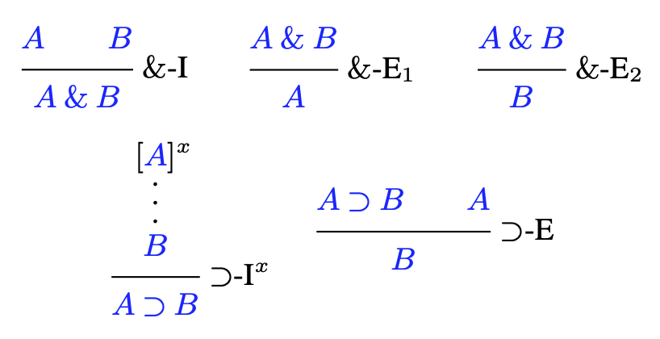
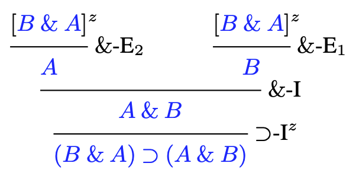
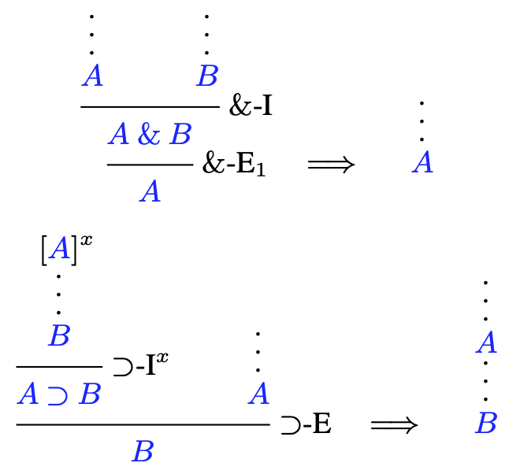
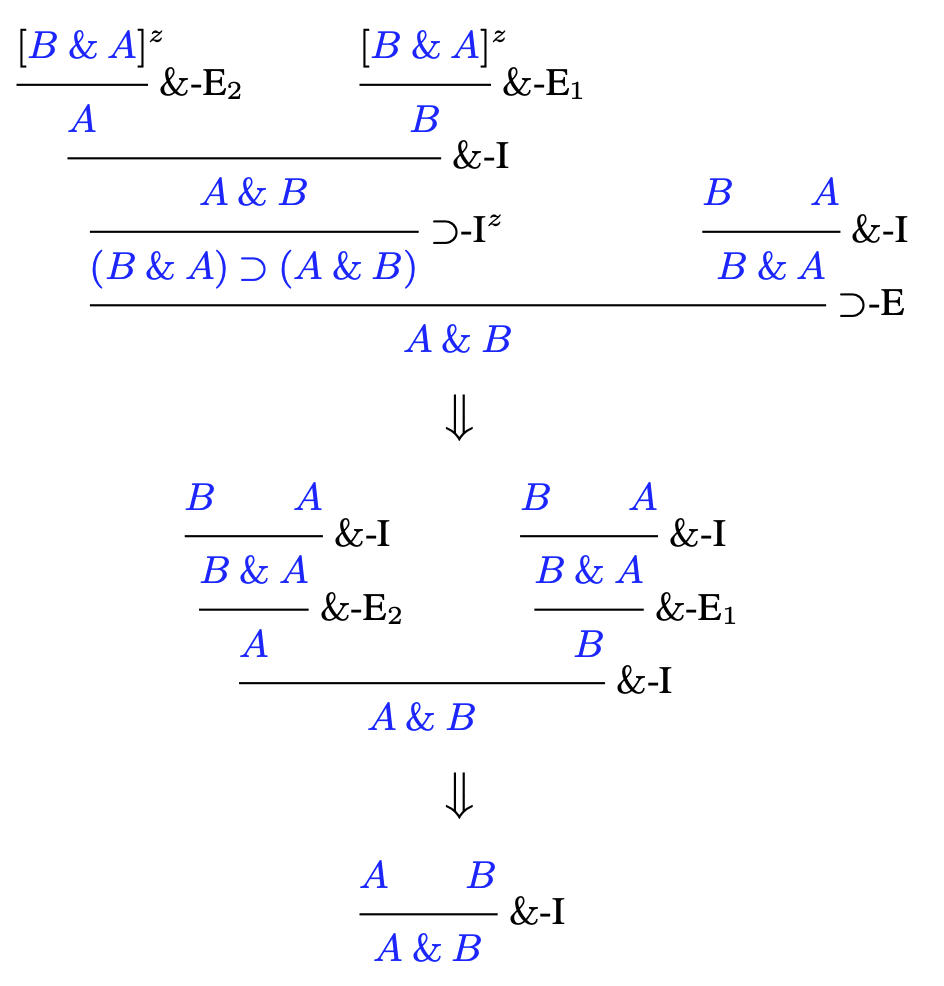
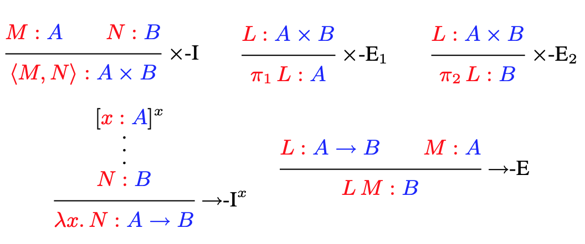
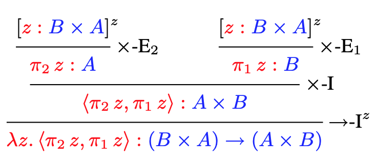
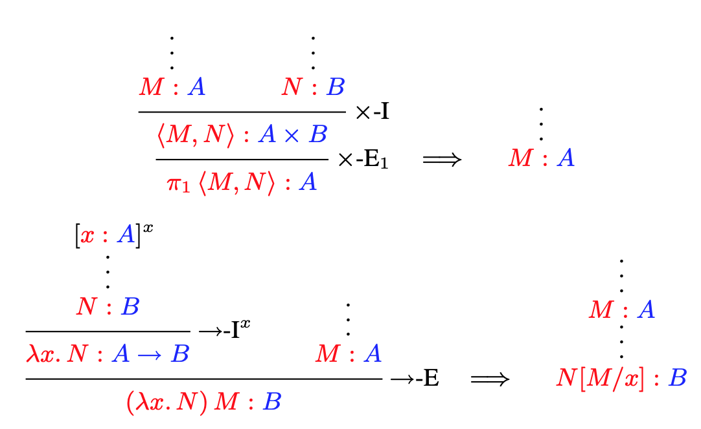
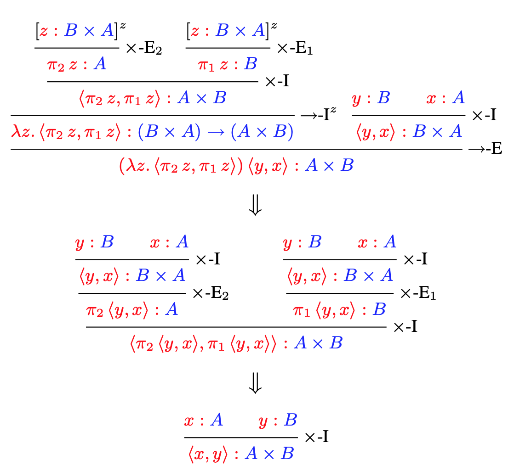
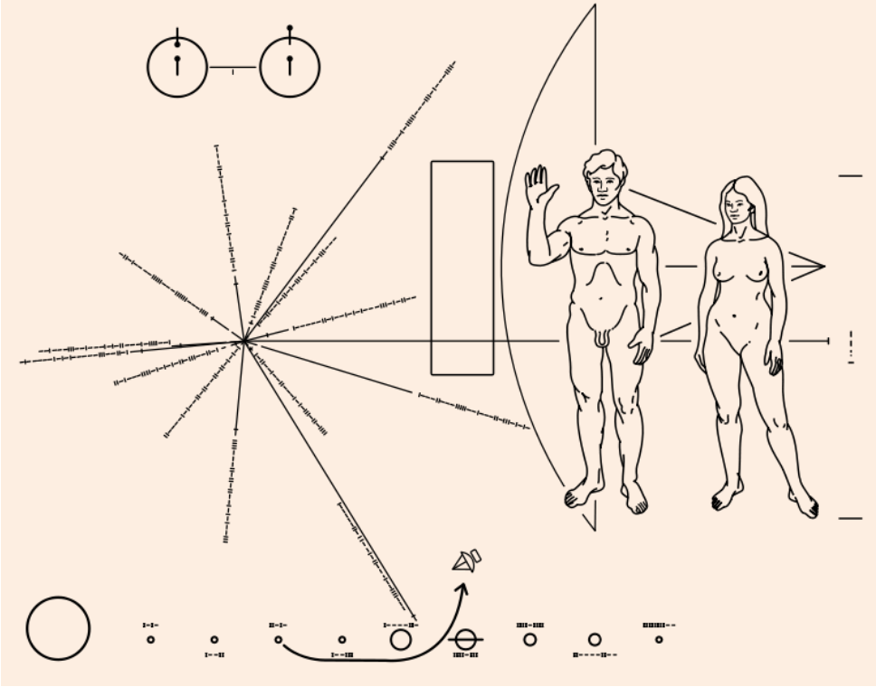

# Propositions as Types

Philip Wadler

University of Edinburgh <wadler@inf.ed.ac.uk>

## 1.   Introduction

Powerful insights arise from linking two fields of study previously thought separate. Examples include Descartes’s coordinates, which links geometry to algebra, Planck’s Quantum Theory, which links particles to waves, and Shannon’s Information Theory, which links thermodynamics to communication. Such a synthesis is offered by the principle of Propositions as Types, which links logic to computation. At first sight it appears to be a simple coincidence — almost a pun—but it turns out to be remarkably robust, inspiring the design of automated proof assistants and programming languages, and continuing to influence the forefronts of computing.

  Propositions as Types is a notion with many names and many origins. It is closely related to the BHK Interpretation, a view of logic developed by the intuitionists Brouwer, Heyting, and Kolmogorov in the 1930s. It is often referred to as the Curry-Howard Isomorphism, referring to a correspondence observed by Curry in 1934 and refined by Howard in 1969 (though not published until 1980, in a Festschrift dedicated to Curry). Others draw attention to significant contributions from de Bruijn’s Automath and Martin-Lof’s Type Theory in the 1970s. Many variant names appear in the literature, including Formulae as Types, Curry-Howard-de Bruijn Correspondence, Brouwer’s Dictum, and others.

   Propositions as Types is a notion with depth. It describes a correspondence between a given logic and a given programming language. At the surface, it says that for each proposition in the logic there is a corresponding type in the programming language — and vice versa. Thus we have
   
*propositions as types.*

It goes deeper, in that for each proof of a given proposition, there is a program of the corresponding type — and vice versa. Thus we also have

*proofs as programs.*

And it goes deeper still, in that for each way to simplify a proof there is a corresponding way to evaluate a program — and vice versa. Thus we further have

*simplification of proofs as evaluation of programs.*

Hence, we have not merely a shallow bijection between propositions and types, but a true isomorphism preserving the deep structure of proofs and programs, simplification and evaluation.

   Propositions as Types is a notion with breadth. It applies to a range of logics including propositional, predicate, second-order, intuitionistic, classical, modal, and linear. It underpins the foundations of functional programming, explaining features including functions, records, variants, parametric polymorphism, data abstraction, continuations, linear types, and session types. It has inspired automated proof assistants and programming languages including `Agda`, `Automath`, `Coq`, `Epigram`, `F#`, `F*`, `Haskell`, `LF`, `ML`, `NuPRL`, `Scala`, `Singularity`, and `Trellys`.

   Propositions as Types is a notion with mystery. Why should it be the case that intuitionistic natural deduction, as developed by Gentzen in the 1930s, and simply-typed lambda calculus, as developed by Church around the same time for an unrelated purpose, should be discovered thirty years later to be essentially identical? And why should it be the case that the same correspondence arises again and again? The logician Hindley and the computer scientist Milner independently developed the same type system, now dubbed Hindley-Milner. The logician Girard and the computer scientist Reynolds independently developed the same calculus, now dubbed Girard-Reynolds. Curry-Howard is a double-barrelled name that ensures the existence of other double-barrelled names. Those of us that design and use programming languages may often feel they are arbitrary, but Propositions as Types assures us some aspects of programming are absolute.

  An online appendix contains this paper in full with additional details and references, plus a historic note provided by William Howard. (The version you are reading is the online appendix.)

  This paper serves as a brief introduction to Propositions as Types. For those interested to learn more, textbook treatments are available [23, 59, 56].

## 2. Church, and the theory of computation

The origins of logic lie with Aristotle and the stoics in classical Greece, Ockham and the scholastics in the middle ages, and Leibniz’s vision of a *calculus ratiocinator* at the dawn of the enlightenment. Our interest in the subject lies with formal logic, which emerged from the contributions of Boole, De Morgan, Frege, Peirce, Peano, and others in the 19th century.

   As the 20th century dawned, Whitehead and Russell’s *Principia Mathematica* [66] demonstrated that formal logic could express a large part of mathematics. Inspired by this vision, Hilbert and his colleagues at Gottingen became the leading proponents of formal logic, aiming to put it on a firm foundation.

   One goal of Hilbert’s Program was to solve the *Entscheidungsproblem* (decision problem), that is, to develop an “effectively calculable” procedure to determine the truth or falsity of any statement. The problem presupposes completeness: that for any statement, either it or its negation possesses a proof. In his address to the 1930 Mathematical Congress in Konigsberg, Hilbert affirmed his belief in this principle, concluding “Wir mussen wis-sen, wir werden wissen” (“We must know, we will know”), words later engraved on his tombstone. Perhaps a tombstone is an appropriate place for those words, given that any basis for Hilbert’s optimism had been undermined the day before, when at the selfsame conference Godel [24] announced his proof that arithmetic is incomplete.

   While the goal was to satisfy Hilbert’s program, no precise definition of “effectively calculable” was required. It would be clear whether a given procedure was effective or not, like Justice Stewart’s characterisation of obscenity, “I know it when I see it”. But to show the *Entscheidungsproblem* undecidable required a formal definition of “effectively calculable”.

  One can find allusions to the concept of algorithm in the work of Euclid and, eponymously, al-Khwarizmi, but the concept was only formalised in the 20th century, and then simultaneously received three independent definitions by logicians. Like buses: you wait two thousand years for a definition of “effectively calculable”, and then three come along at once. The three were *lambda calculus*, published 1936 by Alonzo Church [9], *recursive functions*, proposed by Godel at lectures in Princeton in 1934 and published 1936 by Stephen Kleene [35], and *Turing machines*, published 1937 by Alan Turing [60].

   Lambda calculus was introduced by Church at Princeton, and further developed by his students Rosser and Kleene. At this time, Princeton rivalled Gottingen as a centre for the study of logic. The Institute for Advanced Study was co-located with the mathematics department in Fine Hall. In 1933, Einstein and von Neumann joined the Institute, and Godel arrived for a visit.

   Logicians have long been concerned with the idea of function. Lambda calculus provides a concise notation for functions, including “first-class” functions that may appear as arguments or results of other functions. It is remarkably compact, containing only three constructs: variables, function abstraction, and function application. Church [7] at first introduced lambda calculus as a way to define notations for logical formulas (almost like a macro language) in a new presentation of logic. All forms of bound variable could be subsumed to lambda binding. (For instance, instead of `∃x. A[x]`, Church wrote `Σ(λx. A[x]`].) However, it was later discovered by Kleene and Rosser [38] that Church’s system was inconsistent. By this time, Church and his students had realised that the system was of independent interest. Church had foreseen this possibility in his first paper on the subject, where he wrote “There may, indeed, be other applications of the system than its use as a logic.”

   Church discovered a way of encoding numbers as terms of lambda calculus. The number `n` is represented by a function that accepts a function `f` and a value `x`, and applies the function to the value `n` times. (For instance, three is `λf.λx.f(f(f(x)))`.) With this representation, it is easy to encode lambda terms that can add or multiply, but it was not clear how to encode the predecessor function, which finds the number one less than a given number. One day in the dentist’s office, Kleene suddenly saw how to define predecessor [34]. When Kleene brought the result to his supervisor, Church confided that he had nearly convinced himself that representing predecessor in lambda calculus was impossible. Once this hurdle was overcome, Church and his students soon became convinced that any “effectively calculable” function of numbers could be represented by a term in the lambda calculus.

   Church proposed λ-definability as the definition of “effectively calculable”, what we now know as Church’s Thesis, and demonstrated that there was a problem whose solution was not λ-definable, that of determining whether a given λ-term has a normal form, what we now know as the Halting Problem [9]. A year later, he demonstrated there was no λ-definable solution to the Entscheidungsproblem [8].

   In 1933, Godel arrived for a visit at Princeton. He was unconvinced by Church’s contention that every effectively calculable function was λ-definable. Church responded by offering that if Godel would propose a different definition, then Church would “undertake to prove it was included in λ-definability”. In a series of lectures at Princeton in 1934, based on a suggestion of Herbrand, Godel proposed what came to be known as “general recursive functions” as his candidate for effective calculability. Kleene took notes and published the definition [35]. Church and his students soon determined that the two definitions are equivalent: every general recursive function is λ-definable, and vice-versa. The proof was outlined by Church [8] and published in detail by Kleene [36]. Rather than mollifying Godel, this result caused him to doubt that his own definition was correct! Things stood at an impasse.

   Meanwhile, at Cambridge, Alan Turing, a student of Max Newman, independently formulated his own notion of “effectively calculable” in the form of what we now call a Turing Machine, and used this to show the *Entscheidungsproblem* undecidable. Before the paper was published, Newman was dismayed to discover that Turing had been scooped by Church. However, Turing’s approach was sufficiently different from Church’s to merit independent publication. Turing hastily added an appendix sketching the equivalence of λ-definability to his machines, and his paper [60] appeared in print a year after Church’s, when Turing was 23. Newman arranged for Turing to travel to Princeton, where he completed a doctorate under Church’s supervision.

   Turing’s most significant difference from Church was not in logic or mathematics but in philosophy. Whereas Church merely presented the definition of λ-definability and baldly claimed that it corresponded to effective calculability, Turing undertook an analysis of the capabilities of a “computer” — at this time, the term referred to a human performing a computation assisted by paper and pencil. Turing argued that the number of symbols must be finite (for if infinite, some symbols would be arbitrarily close to each other and undistinguishable), that the number of states of mind must be finite (for the same reason), and that the number of symbols under consideration at one moment must be bounded (“We cannot tell at a glance whether 9999999999999999 and 999999999999999 are the same”). Later, Gandy [18] would point out that Turing’s argument amounts to a theorem asserting that any computation a human with paper and pencil can perform can also be performed by a Turing Machine. It was Turing’s argument that finally convinced Godel; since λ-definability, recursive functions, and Turing machines had been proved equivalent, he now accepted that all three defined “effectively calculable”.

   As mentioned, Church’s first use of lambda calculus was to encode formulas of logic, but this had to be abandoned because it led to inconsistency. The failure arose for a reason related to Russell’s paradox, namely that the system allowed a predicate to act on itself, and so Church adapted a solution similar to Russell’s, that of classifying terms according to types. Church’s simply-typed lambda calculus ruled out self-application, permitting lambda calculus to support a consistent logical formulation [10].

   Whereas self-application in Russell’s logic leads to paradox, self-application in Church’s untyped lambda calculus leads to non-terminating computations. Conversely, Church’s simply-typed lambda calculus guarantees every term has a normal form, that is, corresponds to a computation that halts.

   The two applications of lambda calculus, to represent computation and to represent logic, are in a sense mutually exclusive. If a notion of computation is powerful enough to represent any effectively calculable procedure, then that notion is not powerful enough to solve its own Halting Problem: there is no effectively calculable procedure to determine whether a given effectively calculable procedure terminates. However, the consistency of Church’s logic based on simply-typed lambda calculus depends on every term having a normal form.

   Untyped lambda calculus or typed lambda calculus with a construct for general recursion (sometimes called a fixpoint operator) permits the definition of any effectively computable function, but have a Halting Problem that is unsolvable. Typed lambda calculi without a construct for general recursion have a Halting Problem that is trivial — every program halts! — but cannot define some effectively computable functions. Both kinds of calculus have their uses, depending on the intended application.

   As well as fundamental contributions to programming languages, Church also made early contributions to hardware verification and model checking, as described by Vardi [62].

## 3.   Gentzen, and the theory of proof

A second goal of Hilbert’s program was to establish the consistency of various logics. If a logic is inconsistent, then it can derive any formula, rendering it useless.

   In 1935, at the age of 25, Gerhard Gentzen [20] introduced not one but two new formulations of logic, natural deduction and sequent calculus, which became established as the two major systems for formulating a logic, and remain so to this day. He showed how to normalise proofs to ensure they were not “roundabout”, yielding a new proof of the consistency of Hilbert’s system. And, to top it off, to match the use of the symbol `∃` for the existential quantification introduced by Peano, Gentzen introduced the symbol V to denote universal quantification. He wrote implication as `A ⊃ B` (if `A` holds then `B` holds), conjunction as `A & B` (both `A` and `B` hold), and disjunction as `A ∨ B` (at least one of `A` or `B` holds).

   Gentzen’s insight was that proof rules should come in pairs, a feature not present in earlier systems such as Hilbert’s. In natural deduction, these are introduction and elimination pairs. An introduction rule specifies under what circumstances one may assert a formula with a logical connective (for instance, to prove `A ⊃ B`, one may assume `A` and then must prove `B`), while the corresponding elimination rule shows how to use that logical connective (for instance, from a proof of `A ⊃ B` and a proof of `A` one may deduce `B`, a property dubbed *modus ponens* in the middle ages). As Gentzen notes, “The introductions represent, as it were, the ‘definitions’ of the symbols concerned, and the eliminations are no more, in the final analysis, than the consequences of these definitions.”
 
  A consequence of this insight was that any proof could be normalised to one that is not “roundabout”, where “no concepts enter into the proof other than those contained in the final result”. For example, in a normalised proof of the formula `A & B`, the only formulas that may appear are itself and its subformulas, `A` and `B`, and the subformulas of `A` and `B` themselves. No other formula, such as `(B & A) ⊃ (A & B)` or `A ∨ B`, may appear; this is called the Subformula Property. An immediate consequence was consistency. It is a contradiction to prove false, written `⋏`. The only way to derive a contradiction is to prove, say, both `A ⊃ ⋏` and `A` for some formula `A`. But given such a proof, one could normalise it to one containing only subformulas of its conclusion, `⋏`. But `⋏` has no subformulas! It is like the old saw, “What part of no don’t you understand?” Logicians became interested in normalisation of proofs because of its role in establishing consistency.

  Gentzen preferred the system of Natural Deduction because it was, in his view, more natural. He introduced Sequent Calculus mainly as a technical device for proving the Subformula Property, though it has independent interest.

   Sequent Calculus has two key properties. First, every proof in Natural Deduction can be converted to a proof in Sequent Calculus, and conversely, so the two systems are equivalent. Second, unlike Natural Deduction, every rule save one has the property that its hypotheses only involve subformulas of those that appear in its conclusion. The one exception, the Cut rule, can always be removed by a process called Cut Elimination. Hence every proof had an equivalent normal form satisfying the Subformula Property. Gentzen’s main interest in Sequent Calculus was to prove the Subformula Property, although Sequent Calculus has features of independent interest, such as providing a more symmetric presentation of classical logic, and today researchers often use formulations closer to Sequent Calculus than to Natural Deduction.

   It is an irony that Gentzen was required to introduce Sequent Calculus in order to prove the Subformula Property for Natural Deduction. He needed a roundabout proof to show the absence of roundabout proofs! Later, in 1965, Prawitz showed how to prove the Subformula Property directly, by introducing a way to simplify Natural Deduction proofs; and this set the ground for Howard’s work described in the next section.

## 4.   Propositions as Types

In 1934, Curry observed a curious fact, relating a theory of functions to a theory of implication [13]. Every type of a function `(A → B)` could be read as a proposition `(A ⊃ B)`, and under this reading the type of any given function would always correspond to a provable proposition. Conversely, for every provable proposition there was a function with the corresponding type. Subsequently, Curry and Feys [14] extended the correspondence from not merely types and propositions to also include term and proofs, and to hint at the relation between evaluation of terms and simplification of proofs.

  In 1969, Howard circulated a xeroxed manuscript [32]. It was not published until 1980, where it appeared in a Festschrift dedicated to Curry. Motivated by Curry’s observation, Howard pointed out that there is a similar correspondence between natural deduction, on the one hand, and simply-typed lambda calculus, on the other, and he made explicit the third and deepest level of the correspondence as described in the introduction, that simplification of proofs corresponds to evaluation of programs. Howard showed the correspondence extends to the other logical connectives, conjunction and disjunction, by extending his lambda calculus with constructs that represent pairs and disjoint sums. Just as proof rules come in introduction and elimination pairs, so do typing rules: introduction rules correspond to ways to define or construct a value of the given type, and elimination rules correspond to ways to use or deconstruct values of the given type.
  
  We can describe Howard’s observation as follows:

*  Conjunction `A & B` corresponds to Cartesian product `A x B`, that is, a record with two fields, also known as a pair. A proof of the proposition `A & B` consists of a proof of `A` and a proof of `B` . Similarly, a value of type `A x B` consists of a value of type `A` and a value of type `B`.
*  Disjunction `A ∨ B` corresponds to a disjoint sum `A + B`, that is, a variant with two alternatives. A proof of the proposition `A ∨ B` consists of either a proof of `A` or a proof of `B`, including an indication of which of the two has been proved. Similarly, a value of type `A + B` consists of either a value of type `A` or a value of type `B`, including an indication of whether this is a left or right summand.
*  Implication `A ⊃ B` corresponds to function space `A → B`. A proof of the proposition `A ⊃ B` consists of a procedure that given a proof of `A` yields a proof of `B` . Similarly, a value of type `A → B` consists of a function that when applied to a value of type `A` returns a value of type `B` .

This reading of proofs goes back to the intuitionists, and is often called the BHK interpretation, named for Brouwer, Heyting, and Kolmogorov. Brouwer founded intuitionism [28], and Heyting [29] and Kolmogorov [39] formalised intuitionistic logic, and developed the interpretation above, in the 1920s and 1930s. Realisability, introduced by Kleene [37] in the 1940s, is based on a similar interpretation.

  Given the intuitionistic reading of proofs, it hardly seems surprising that intuitionistic natural deduction and lambda calculus should correspond so closely. But it wasn’t until Howard that the correspondence was laid out clearly, in a way that allowed working logicians and computer scientists to put it to use.

   Howard’s paper divides into two halves. The first half explains a correspondence between two well-understood concepts, the propositional connectives `&`, `∨`, `⊃` on the one hand and the computational types `×`, `+`, `→` on the other hand. The second half extends this analogy, and for well-understood concepts from logic proposes new concepts for types that correspond to them. In particular, Howard proposes that the predicate quantifiers `∀` and `∃` corresponds to new types that we now call *dependent types*.

   With the introduction of dependent types, every proof in predicate logic can be represented by a term of a suitable typed lambda calculus. Mathematicians and computer scientists proposed numerous systems based on this concept, including de Bruijn’s Automath [17], Martin-Lof’s type theory [43], Bates and Constable’s PRL and nuPRL [3], and Coquand and Huet’s Calculus of Constructions [11], which developed into the Coq proof assistant.

   Applications include CompCert, a certified compiler for the C programming language verified in Coq [41]; a computer-checked proof of the four-colour theorem also verified in Coq [25]; parts of the Ensemble distributed system verified in NuPRL [27, 40]; and twenty thousand lines of browser plug-ins verified in F? [57].  de Bruijn’s work was independent of Howard’s, but Howard directly inspired Martin Lof and all the other work listed above. Howard was (justly!) proud of his paper, citing it as one of the two great achievements of his career [55].

## 5.   Intuitionistic logic

In Gilbert and Sullivan’s *The Gondoliers*, Casilda is told that as an infant she was married to the heir of the King of Batavia, but that due to a mix-up no one knows which of two individuals, Marco or Giuseppe, is the heir. Alarmed, she wails “Then do you mean to say that I am married to one of two gondoliers, but it is impossible to say which?” To which the response is “Without any doubt of any kind whatever.”

   Logic comes in many varieties, and one distinction is between *classical* and *intuitionistic*. Intuitionists, concerned by cavalier assumptions made by some logicians about the nature of infinity, insist upon a constructionist notion of truth. In particular, they insist that a proof of `A ∨ B` must show which of `A` or `B` holds, and hence they would reject the claim that Casilda is married to Marco or Giuseppe until one of the two was identified as her husband. Perhaps Gilbert and Sullivan anticipated intuitionism, for their story’s outcome is that the heir turns out to be a third individual, Luiz, with whom Casilda is, conveniently, already in love.

   Intuitionists also reject the law of the excluded middle, which asserts `A ∨ ¬A` for every `A`, since the law gives no clue as to which of `A` or `¬A` holds. Heyting formalised a variant of Hilbert’s classical logic that captures the intuitionistic notion of provability. In particular, the law of the excluded middle is provable in Hilbert’s logic, but not in Heyting’s. Further, if the law of the excluded middle is added as an axiom to Heyting’s logic, then it becomes equivalent to Hilbert’s. Kolmogorov showed the two logics were closely related: he gave a double-negation translation, such that a formula is provable in classical logic if and only if its translation is provable in intuitionistic logic.

   Propositions as Types was first formulated for intuitionistic logic. It is a perfect fit, because in the intuitionist interpretation the formula `A ∨ B` is provable exactly when one exhibits either a proof of `A` or a proof of `B`, so the type corresponding to disjunction is a disjoint sum.

## 6.   Other logics, other computation

The principle of Propositions as Types would be remarkable even if it applied only to one variant of logic and one variant of computation. How much more remarkable, then, that it applies to a wide variety of logics and of computation.

   Quantification over propositional variables in second-order logic corresponds to type abstraction in second-order lambda calculus. For this reason, the second-order lambda calculus was discovered twice, once by the logician Jean-Yves Girard [21] and once by the computer scientist John Reynolds [53]. And for the same reason, a similar system that supports principle type inference was also discovered twice, once by the logician Roger Hindley [30] and once by the computer scientist Robin Milner [45]. Building on the correspondence, John Mitchell and Gordon Plotkin [46] observed that existential quantification in second-order logic corresponds precisely to data abstraction, an idea that now underpins much research in the semantics of programming languages. The design of generic types in Java and C# draws directly upon Girard-Reynolds, while the type systems of functional languages including ML and Haskell are based upon Hindley-Milner. Philosophers might argue as to whether mathematical systems are ‘discovered’ or ‘devised’, but the same system arising in two different contexts argues that here the correct word is ‘discovered’.

   Two major variants of logic are intuitionistic and classical. Howard’s original paper observed a correspondence with intu-itionistic logic. Not until two decades later was the correspondence extended to also apply to classical logic, when Tim Griffin [26] observed that Peirce’s Law in classical logic provides a type for the call/cc operator of Scheme. Chet Murthy [49] went on to note that Kolmogorov and Godel’s double-negation translation, widely used to relate intuitionistic and classical logic, corresponds to the continuation-passing style transformation widely used both by semanticists and implementers of lambda calculus. Parigot [50], Curien and Herbelin [12], and Wadler [64] introduced various computational calculi motivated by correspondences to classical logic.

   Modal logic permits propositions to be labelled as ‘necessarily true’ or ‘possibly true’. Clarence Lewis introduced modal logic in 1910, and his 1938 textbook [42] describes five variants, S1-S5. Some claim that each of these variants has an interpretation as a form of computation via Propositions as Types, and a down payment on this claim is given by an interpretation of S4 as staged computation due to Davies and Pfenning [16], and of S5 as spatially distributed computation due to Murphy et al [48].

   Eugenio Moggi [47] introduced monads as a technique to explain the semantics of important features of programming languages such as state, exceptions, and input-output. Monads became widely adopted in the functional language Haskell, and later migrated into other languages, including Clojure, Scala, F#, and C#. Benton, Bierman, and de Paiva [4] observed that monads correspond to yet another modal logic, differing from all of S1-S5.

   Temporal logic admits distinction between modalities such as ‘holds now’, ‘will hold eventually’, and ‘will hold in the next time step’. Temporal logic was first formalised by Arthur Prior in his 1957 text [52], and came to play a major role in the specification and verification of computing systems, beginning with the work of Amir Pnueli [51]. Interpretations of temporal logics via Propositions as Types include an application to partial evaluation due to Davies [15], and an application to functional reactive programming due to Jeffery [33].

   In classical, intuitionistic, and modal logic, any hypothesis can be used an arbitrary number of times—zero, once, or many. Linear logic, introduced in 1987 by Girard [22], requires that each hypothesis is used exactly once. Linear logic is ‘resource conscious’ in that facts may be used up and superseded by other facts, suiting it for reasoning about a world where situations change. From its inception, linear logic was suspected to apply to problems of importance to computer scientists, and its first publication was not in *Annals of Mathematics* but in *Theoretical Computer Science*. Computational aspects of linear logic are discussed by Abramsky [1] and Wadler [63], among many others, and applications to quantum computing are surveyed by Gay [19]. Most recently, Session Types, a way of describing communication protocols introduced by Honda [31], have been related to intuitionistic linear logic by Caires and Pfenning [5], and to classical linear logic by Wadler [65].

   One key to the correspondence between logic and computation is the study of category theory. Both simply-typed lambda calculus and intuitionistic natural deduction correspond to the notion of a cartesian closed category [54]. Many extensions of this idea arise, including an exciting strand of work linking categories, computation, linear logic, and quantum physics [2].
   
   Vladimir Voevodsky, a winner of the Fields Medal, excited much interest with his recent work on Homotopy Type Theory (HoTT) and Univalent Foundations, which links topology to Propositions as Types. A Special Year devoted to the subject and hosted by the Institute for Advanced Studies at Princeton, Church’s home, led to the publication last year of The HoTT Book, which indeed was hotly awaited, and authored by over 50 mathematicians and computer scientists ranging from Aczel to Zeilenberg.

   Propositions as Types remains a topic of active research.

## 7.   Natural deduction

We now turn to a more formal development, presenting a fragment of natural deduction and a fragment of typed lambda calculus in a style that makes clear the connection between the two.

   We begin with the details of natural deduction as defined by Gentzen [20]. The proof rules are shown in Figure 1. To simplify our discussion, we consider just two of the connectives of natural deduction. We write `A` and `B` as placeholders standing for arbitrary formulas. Conjunction is written `A & B` and implication is written `A ⊃ B`.

---

Figure 1. Gerhard Gentzen (1935) — Natural Deduction

   We represent proofs by trees, where each node of the tree is an instance of a proof rule. Each proof rule consists of zero or more formulas written above a line, called the *premises*, and a single formula written below the line, called the *conclusion*. The interpretation of a rule is that when all the premises hold, then the conclusion follows.

   The proof rules come in pairs, with rules to introduce and to eliminate each connective, labelled `-I` and `-E` respectively. As we read the rules from top to bottom, introduction and elimination rules do what they say on the tin: the first *introduces* a formula for the connective, which appears in the conclusion but not in the premises; the second *eliminates* a formula for the connective, which appears in a premise but not in the conclusion. An introduction rule describes under what conditions we say the connective holds — how to *define* the connective. An elimination rule describes what we may conclude when the connective holds — how to use the connective.

   The introduction rule for conjunction, `&-I`, states that if formula `A` holds and formula `B` holds, then the formula `A & B` must hold as well. There are two elimination rules for conjunction. The first, `&-E1`, states that if the formula `A & B` holds, then the formula `A` must hold as well. The second, `&-E2`, concludes `B` rather than `A`.

   The introduction rule for implication, `⊃-I`, states that if from the assumption that formula `A` holds we may derive the formula `B`, then we may conclude that the formula `A ⊃ B` holds and *discharge* the assumption. To indicate that `A` is used as an assumption zero, once, or many times in the proof of `B`, we write `A` in brackets and tether it to `B` via ellipses. A proof is complete only when every assumption in it has been discharged by a corresponding use of `⊃-I`, which is indicated by writing the same name (here `x`) as a superscript on each instance of the discharged assumption and on the discharging rule. The elimination rule for implication, `⊃-E`, states that if formula `A ⊃ B` holds and if formula `A` holds, then we may conclude formula `B` holds as well; as mentioned earlier, this rule also goes by the name *modus ponens*.

  Critical readers will observe that we use similar language to describe rules (‘when-then’) and formulas (‘implies’). The same idea applies at two levels, the meta level (rules) and the object level (formulas), and in two notations, using a line with premises above and conclusion below for implication at the meta level, and the symbol `⊃` with premise to the left and conclusion to the right at the object level. It is almost as if to understand implication one must first understand implication! This Zeno’s paradox of logic was wryly observed by Lewis Carroll [6], and the phenomenon was deeply investigated by Martin Lof [44]. We need not let it disturb us; everyone possesses a good informal understanding of implication, which may act as a foundation for its formal description.

   A proof of the formula

`(B & A) ⊃ (A & B)`.

is shown in Figure 2. In other words, if `B` and `A` hold then `A` and `B` hold. This may seem so obvious as to be hardly deserving of proof! However, the formulas `B ⊃ A` and `A ⊃ B` have meanings that differ, and we need some formal way to conclude that the formulas `B & A` and `A & B` have meanings that are the same. This is what our proof shows, and it is reassuring that it can be constructed from the rules we posit.

---

Figure 2.  A proof

   The proof reads as follows. From `B & A` we conclude `A`, by `&-E2`, and from `B & A` we also conclude `B`, by `&-E1`. From `A` and `B` we conclude `A & B`, by `&-I`. That is, from the assumption `B & A` (used twice) we conclude `A & B` . We discharge the assumption and conclude `(B & A) ⊃ (A & B)` by `⊃-I`, linking the discharged assumptions to the discharging rule by writing `z` as a superscript on each.

   Some proofs are unnecessarily roundabout. Rules for simplifying proofs appear in Figure 3, and an example of such a proof appears in Figure 4. Let’s focus on the example first.

---

Figure 3.  Simplifying proofs

---

Figure 4.  Simplifying a proof

   The top of Figure 4 shows a larger proof built from the proof in Figure 2. The larger proof assumes as premises two formulas, `B` and `A`, and concludes with the formula `A & B`. However, rather than concluding it directly we derive the result in a roundabout way, in order to illustrate an instance of `⊃-E`, *modus ponens*. The proof reads as follows. On the left is the proof given previously, concluding in `(B & A) ⊃ (A & B)`. On the right, from `B` and `A` we conclude `B & A` by `&-I`. Combining these yields `A & B` by `⊃-E`.

   We may simplify the proof by applying the rewrite rules of Figure 3. These rules specify how to simplify a proof when an introduction rule is immediately followed by the corresponding elimination rule. Each rule shows two proofs connected by an arrow, indicating that the *redex* (the proof on the left) may be rewritten, or simplified, to yield the *reduct* (the proof on the right). Rewrites always take a valid proof to another valid proof.

   For `&`, the redex consists of a proof of `A` and a proof of `B`, which combine to yield `A & B` by `&-I`, which in turn yields `A` by `&-E1`. The reduct consists simply of the proof of `A`, discarding the unneeded proof of `B`. There is a similar rule, not shown, to simplify an occurrence of `&-I` followed by `&-E2`.

   For `⊃`, the redex consists of a proof of `B` from assumption `A`, which yields `A ⊃ B` by `⊃-I`, and a proof of `A`, which combine to yield `B` by `⊃-E`. The reduct consists of the same proof of `B`, but now with every occurrence of the assumption `A` replaced by the given proof of `A`. The assumption `A` may be used zero, once, or many times in the proof of `B` in the redex, so the proof of `A` may be copied zero, once, or many times in the proof of `B` in the reduct. For this reason, the reduct may be larger than the redex, but it will be simpler in the sense that it has removed an unnecessary detour via the subproof of `A ⊃ B`.
 
   We can think of the assumption of `A` in `⊃-I` as a debt which is discharged by the proof of A provided in `⊃-E`. The proof in the redex accumulates debt and pays it off later; while the proof in the reduct pays directly each time the assumption is used. Proof debt differs from monetary debt in that there is no interest, and the same proof may be duplicated freely as many times as needed to pay off an assumption, the very property which money, by being hard to counterfeit, is designed to avoid!

   Figure 4 demonstrates use of these rules to simplify a proof. The first proof contains an instance of `⊃-I` followed by `⊃-E`, and is simplified by replacing each of the two assumptions of `B & A` on the left by a copy of the proof of `B & A` on the right. The result is the second proof, which as a result of the replacement now contains an instance of `&-I` followed by `&-E2`, and another instance of `&-I` followed by `&-E1`. Simplifying each of these yields the third proof, which derives `A & B` directly from the assumptions `A` and `B`, and can be simplified no further.

   It is not hard to see that proofs in normal form satisfy the Subformula Property: every formula of such a proof must be a subformula of one of its undischarged assumptions or of its conclusion. The proof in Figure 2 and the final proof of Figure 4 both satisfy this property, while the first proof of Figure 4 does not, since `(B & A) D (A & B)` is not a subformula of `A & B`.

## 8.   Lambda calculus

We now turn our attention to the simply-typed lambda calculus of Church [10]. The type rules are shown in Figure 5. To simplify our discussion, we take both products and functions as primitive types; Church’s original calculus contained only function types, with products as a derived construction. We now write `A` and `B` as placeholders for arbitrary types, and `L`, `M`, `N` as placeholder for arbitrary terms. Product types are written `A x B` and function types are written `A → B`. Now instead of formulas, our premises and conclusions are judgments of the form

`M:A`

indicating that term M has type A.

---

Figure 5. Alonzo Church (1935) — Lambda Calculus

   Like proofs, we represent type derivations by trees, where each node of the tree is an instance of a type rule. Each type rule consists of zero or more judgments written above a line, called the premises, and a single judgment written below the line, called the conclusion. The interpretation of a rule is that when all the premises hold, then the conclusion follows.

   Like proof rules, type rules come in pairs. An introduction rule describes how to *define* or *construct* a term of the given type, while an elimination rule describes how to use or *deconstruct* a term of the given type.

   The introduction rule for products, `×-I`, states that if term `M` has type `A` and term `N` has type `B`, then we may form the pair term `⟨M,N⟩` of product type `A × B`. There are two elimination rules for products. The first, `×-E1` , states that if term `L` has type `A × B`, then we may form the term `π₁ L` of type `A`, which selects the first component of the pair. The second, `×-E2` is similar, save that it forms the term `π₂ L` of type `B`.

   The introduction rule for functions, `→-I`, states that if given a variable `x` of type `A` we have formed a term `N` of type `B`, then we may form the lambda term `λx. N` of function type `A → B`. The variable `x` appears free in `N` and bound in `λx. N`. Undischarged assumptions correspond to free variables, while discharged assumptions correspond to bound variables. To indicate that the variable `x` may appear zero, once, or many times in the term `N`, we write `x : A` in brackets and tether it to `N : B` via ellipses. A term is closed only when every variable in it is bound by a corresponding λ term. The elimination rule for functions, `→-E`, states that given term `L` of type `A → B` and term `M` of type `A` we may form the application term `L M` of type `B`.

   For natural deduction, we noted that there might be confusion between implication at the meta level and the object level. For lambda calculus the distinction is clearer, as we have implication at the meta level (if terms above the line are well typed so are terms below) but functions at the object level (a function has type `A → B` because if it is passed a value of type `A` then it returns a value of type `B`). What previously had been discharge of assumptions (perhaps a slightly diffuse concept) becomes binding of variables (a concept understood by most computer scientists).

  The reader will by now have observed a striking similarity between Gentzen’s rules from the preceding section and Church’s rules from this section: ignoring the terms in Church’s rules then they are identical, if one replaces `&` by `×` and `⊃` by `→`. The colouring of the rules is chosen to highlight the similarity.

  A program of type

`(B × A) → (A × B)`

is shown in Figure 6. Whereas the difference between `B & A` and `A & B` appears a mere formality, the difference between `B × A` and `A × B` is easier to appreciate: converting the latter to the former requires swapping the elements of the pair, which is precisely the task performed by the program corresponding to our former proof.

---

Figure 6. A program

  The program reads as follows. From variable `z` of type `B × A` we form term `n₂ z` of type `A` by `x -E₂` and also term `π2 z` of type `B` by `×-E2`. From these two we form the pair `π1 z` of type `A × B` by `×-I`. Finally, we bind the free variable `z` to form the lambda term `λz.⟨π2 z, π1 z⟩` of type `(B × A) → (A × B)` by `→-I`, connecting the bound typings to the binding rule by writing `z` as a superscript on each. The function accepts a pair and swaps its elements, exactly as described by its type.

  A program may be evaluated by rewriting. Rules for evaluating programs appear in Figure 7, and an example appears in Figure 8. Let’s focus on the example first.

---

Figure 7.  Evaluating programs

  The top of Figure 8 shows a larger program built from the program in Figure 6. The larger program has two free variables, `y` of type `B` and `x` of type `A`, and constructs a value of type `A × B` . However, rather than constructing it directly we reach the result in a roundabout way, in order to illustrate an instance of `→-E`, function application. The program reads as follows. On the left is the program given previously, forming a function of type `(B × A) → (A × B)`. On the right, from `B` and `A` we form the pair `⟨y, x⟩` of type `B × A` by `×-I`. Applying the function to the pair forms a term of type `A × B` by `→-E`.

---

Figure 8.  Evaluating a program

  We may evaluate this program by applying the rewrite rules of Figure 7. These rules specify how to rewrite a term when an introduction rule is immediately followed by the corresponding elimination rule. Each rule shows two derivations connected by an arrow, indicating that the redex (the term on the left) may be rewritten, or evaluated, to yield the reduct (the term on the right). Rewrites always take a valid type derivation to another valid type derivation, ensuring that rewrites preserve types, a property known as subject reduction or type soundness.

  For `×`, the redex consists of term `M` of type `A` and term `N` of type `B`, which combine to yield term `hM, N}` of type `A × B` by `×-I`, which in turn yields term `π1 ⟨M,N⟩` of type `A` by `×-Eᵢ`. The reduct consists simply of term `M` of type `A`, discarding the unneeded term `N` of type `B`. There is a similar rule, not shown, to rewrite an occurrence of `×-I` followed by `×-E2` .

  For `→`, the redex consists of a derivation of term `N` of type `B` from variable `x` of type `A`, which yields the lambda term `λx. N` of type `A → B` by `→-I`, and a derivation of term `M` of type `A`, which combine to yield the application `(λx. N) M` of type `B` by `→-E`. The reduct consists of the term `N [M/x]` that replaces each free occurrence of the variable `x` in term `N` by term `M` . Further, if in the derivation that `N` has type `B` we replace each assumption that `x` has type `A` by the derivation that `M` has type `A`, we get a derivation showing that `N [M/x]` has type `B`. Since the variable `x` may appear zero, once, or many times in the term `N`, the term `M` may be copied zero, once, or many times in the reduct `N [M/x]`. For this reason, the reduct may be larger than the redex, but it will be simpler in the sense that is has removed a subterm of type `A → B`. Thus, discharge of assumptions corresponds to applying a function to its argument.

  Figure 8 demonstrates use of these rules to evaluate a program. The first program contains an instance of `→-I` followed by `→-E`, and is rewritten by replacing each of the two occurrences of `z` of type `B x A` on the left by a copy of the term `⟨y, x⟩` of type `B × A` on the right. The result is the second program, which as a result of the replacement now contains an instance of `×-I` followed by `×-E2`, and another instance of `×-I` followed by `×-E1` . Rewriting each of these yields the third program, which derives the term `⟨x, y⟩` of type `A × B`, and can be evaluated no further.

   Hence, simplification of proofs corresponds exactly to evaluation of programs, in this instance demonstrating that applying the function to the pair indeed swaps its elements.

##9.   Conclusion

Proposition as Types informs our view of the universality of certain programming languages.

   The Pioneer spaceship contains a plaque designed to communicate with aliens, if any should ever intercept it (see Figure 9). They may find some parts of it easier to interpret than others. A radial diagram shows the distance of fourteen pulsars and the centre of the galaxy from Sol. Aliens are likely to determine that the length of each line is proportional to the distances to each body. Another diagram shows humans in front of a silhouette of Pioneer. If Star Trek gives an accurate conception of alien species, they may respond “They look just like us, except they lack pubic hair.” However, if the aliens’s perceptual system differs greatly from our own, they may be unable to decipher these squiggles.

---

Figure 9. Plaque on Pioneer Spaceship

   What would happen if we tried to communicate with aliens by transmitting a computer program? In the movie Independence Day, the heroes destroy the invading alien mother ship by infecting it with a computer virus. Close inspection of the transmitted program shows it contains curly braces—it is written in a dialect of `C`! It is unlikely that alien species would program in `C`, and unclear that aliens could decipher a program written in `C `if presented with one.

   What about lambda calculus? Propositions as Types tell us that lambda calculus is isomorphic to natural deduction. It seems difficult to conceive of alien beings that do not know the fundamentals of logic, and we might expect the problem of deciphering a program written in lambda calculus to be closer to the problem of understanding the radial diagram of pulsars than that of understanding the image of a man and a woman on the Pioneer plaque.

   We might be tempted to conclude that lambda calculus is universal, but first let’s ponder the suitability of the word ‘universal’. These days the multiple worlds interpretation of quantum physics is widely accepted. Scientists imagine that in different universes one might encounter different fundamental constants, such as the strength of gravity or the Planck constant. But easy as it may be to imagine a universe where gravity differs, it is difficult to conceive of a universe where fundamental rules of logic fail to apply. Natural deduction, and hence lambda calculus, should not only be known by aliens throughout our universe, but also throughout others. So we may conclude it would be a mistake to characterise lambda calculus as a universal language, because calling it universal would be *too limiting*.

**Acknowledgements**. Thank you to Gershom Bazerman, Pete Bevin, Guy Blelloch, Rintcius Blok, Ezra Cooper, Ben Darwin, Benjamin Denckla, Peter Dybjer, Johannes Emerich, Martin Er-wig, Yitz Gale, Mikhail Glushenkov, Gabor Greif, Vinod Grover, Sylvain Henry, Philip Holzenspies, William Howard, John Hughes, Colin Lupton, Daniel Marsden, Craig McLaughlin, Tom Moertel, Simon Peyton-Jones, Benjamin Pierce, Lee Pike, Andres Sicard-Ramlrez, Scott Rostrup, Dann Toliver, Moshe Vardi, Jeremy Yal-lop, Richard Zach, Leo Zovik, and the referees. This work was funded under EPSRC EP/K034413/1.

  Philip Wadler (wadler@inf.ed.ac.uk, @PhilipWadler) is Professor of Theoretical Computer Science in the Laboratory for Foundations of Computer Science in the School of Informatics at the University of Edinburgh, Scotland.

## A. Howard on Curry-Howard

While writing this paper, I realised Iwas unclear on parts of the history. Below is a letter I wrote to William Howard and his response (with corrections he provided after I asked to publish it). I believe it is a useful historical document, and am grateful to Howard for his permission to publish. The correspondence refers to Shell-Gellasch [55], and references to Figures 5 and 6 in the following are to the figures in this paper.

Here is my original request.

---

Subject: The Formulae-as-Types Notion of Construction

---

Dear Prof Howard,

   My research has been greatly influenced by your own, particularly the paper cited in my subject. I am now writing a paper on the field of work that grew out of that paper, which was solicited for publications by the Communications of the ACM (the flagship of the professional organisation for computer scientists). A draft of the paper is attached.

   I would like to portray the history of the subject accurately. I have read your interview with Shell-Gallasch, but a few questions remain, which I hope you will be kind enough to answer.

   Your paper breaks into two halves. The first describes the correspondence between propositional logic and simple types, the second introduces the correspondence between predicate logic and dependent types. Did you consider the first half to be new material or merely a reprise of what was known? To what extent do you consider your work draws on or was anticipated by the work of Heyt-ing and Kolmogorov, and Kleene’s realisability? To what extent did your work influence the subsequent work of de Bruijn and Martin Lof? What was the history of your mimeograph on the subject, and why was it not published until the Curry Festschrift in 1980?
 
  Many thanks for your consideration, not to mention for founding my field! Yours, —P

 And here is his response:
 
 ---
 
 Dear Prof. Wadler,
 
 ---
 
 As mentioned in the interview with Shell-Gellasch, my work on propositions as types (p-a-t) originated from my correspondence with Kreisel, who was very interested in getting a mathematical notion (i.e., in ordinary mathematics) for Brouwer’s idea of a construction (as explained by Heyting). I was not familiar with the work of Brouwer or Heyting, let alone Kolmogorov, but, from what Kreisel had to say, the idea was clear enough: a construction of a ^ в was to be a construction F which, acting on a construction A of a, gives a construction B of в. So we have constructions acting on constructions, rather like functionals acting on functionals. So, as an approximation,

(1) let’s take “construction” to mean “functional”.

   But what kind of functionals? In constructive mathematics, a functional is not given as a set of ordered pairs. Rather,

(2) to give a functional is to give not only the action or process it performs but also to give its type (domain and counterdomain).

  Clearly, the type structure is going to be complicated. I set myself the project of finding a suitable notation for the type symbols. So one needs a suitable type symbol for the functional F, above. Well, just take it to be alpha itself (at this point, I was thinking of propositional logic). Suddenly I remembered something that Curry had talked about in the logic seminar during my time at Penn State. If we consider typed combinators, and look at the structure of the type symbols of the basic combinators (e.g., S, K, I), we see that each of the type symbols corresponds to (is isomorphic to) one of the axioms of pure implicative logic. Well! This was just what I needed!

  How do we formulate the following notion?

  (3) `F` is a construction of phi.

  Consider the case in which `φ` has the form `α ⊃ β` The temptation is to define “`F` is a construction of `α ⊃ β` to mean “for all `A`: if `A` is a construction of `α`, then `F A` is a construction of `β`”. Well, that is circular, because we have used “if ... then ...” to define implication. This is what you call “Zenos paradox of logic”. I avoided this circularity by taking (3) to mean:

  (4) `F` is assigned the type `ф` according to the way `F` is built up; i.e., the way in which `F` is constructed.

  Thus `F` is a construction of `ф` by construction. Your Figure 6 illustrates precisely what I meant by this. (I did not have that beautiful notation at the time but it conveys what I meant.)

  To summarize: My basic insight consisted simultaneously of the thoughts (2) and (4) plus the thought that Curry’s observation provided the means to implement (2), (4). Let me say this in a different way. The thought (2) was not new. I had had the thought (2) for many years, ever since I had begun to study primitive recursive functionals of finite type. What was new was the thought (4) plus the recognition that Curry’s idea provided the way to implement (4). I got this basic insight in the summer of 1966. Once I saw how to do it with combinators, I wondered what it would look like from the vewpoint of the lambda calculus, and saw, to my delight, that this corresponded to the intuitionistic version of Gentzen’s sequent calculus.

  Incidentally, Curry’s observation concerning the types of the basic combinators is presented in his book with Feys (Curry-Feys), but I was unaware of this, though I had owned a copy for several years (since 1959, when I was hired at Penn State). After working out the details of p-a-t over a period of several months, I began to think about writing it up, so I thought I had better see if it is in the book. Well, it is easy enough to find if you know what you are looking for. On looking at it, I got a shock: not only had they extended the ideas to Gentzen’s sequent calculus, but they had the connection between elimination of cuts from a derivation and normalization of the corresponding lambda term. But, on a closer look, I concluded that they had a connection but not the connection. It turns out that I was not quite right about that either. See my remark about their Theorem 5, below. Not that it would have mattered much for anything I might have published: even if they had the connection between Gentzen’s sequent calculus and the lambda calculus, I had a far-reaching generalization (i.e., to Heyting arithmetic).
   
   The above is more detailed than would be required to answer your questions, but I needed to write this out to clarify my thoughts about the matter; so I may as well include the above, since I think it will interest you. It answers one of your questions, “To what extent do you consider your work draws on or was anticipated by the work of Heyting and Kolmogorov, and Kleene’s realisability?” Namely, my work draws on the work of Heyting and Brouwer, via Kreisel’s explanation of that work to me. None of it was anticipated by the work of Heyting, Kolmogorov or Kleene: they were not thinking of functionals of finite type. Though I was familiar with Kleene’s recursive realizability, I was not thinking about it at the time. Admittedly, it touches on ideas about Brouwer’s constructions but is far from capturing the notion of a construction (actually, Kleene once made remarks to this effect, I forget where). Because of the relation between constructions and Kleene’s recursive realizability, there could have been some unconscious influence; but, in any case, not a significant influence.
   
   “Did your work influence the subsequent work of de Bruijn and Martin Lof?” As far as I know, my work had no influence on the work of de Bruijn. His work appears to be completely independent of mine. I do recall that he once sent me a package of Automath material. The project of a computer program for checking existing proofs did not appear very interesting and I did not reply. What I would have been interested in is a program for finding proofs of results that had not yet been proved! Even a proof-assistant would have been fine. Why did he send me the Automath material? I don’t recall what year it was. Sometime in the 1970s. Whatever the accompanying letter, it was not informative; merely something like: ”Dear Professor Howard, you may be interested in the following material ...”. Since that time, I have seen two or three articles by him, and I have a more favorable impression. It is good, solid work. Obviously original. He discovered the idea of derivations as terms, and the accompanying idea of formulae-as-types, on his own. He uses lambda terms but, I think, only for purposes of description. In other words, I don’t think that he has the connection between normalization and cut-elimination, but I have not made an extensive examination of his work. In fact, does he use a Gentzen system at all? I just don’t know. The latter two questions would easily be answered by anyone familiar with his work. In any case, give him credit where credit is due. There are enough goodies for everyone!
   
   My influence on Martin-Lof? No problem there. I met him at the Buffalo 1968 conference and I told him my ideas. His instant reaction was: “Now, why didn’t I think of that?” He had a visiting appointment at UIC for the academic year 1968-1969, so we had lots of opportunity to talk, and he started developing his own approach to the ideas. In January 1969, mainly to make sure that we were both clear on who had discovered what, I wrote up my own ideas in the form of handwritten notes. By then, Xerox machines were prevalent, so I sent a copy to Kreisel, and he gave copies to various people, including Girard. At least, I think that is how Girard got a copy, or maybe Martin-Lof gave him one. I like Martin-Lof’s work. I could say more about this, but the short answer to your question is: Martin-Lof’s work originated from mine. He has always given me credit and we are good friends.
   
   On further thought, I need to mention that, in that first conversation, Martin-Lof suggested that the derivations-as-terms idea would work particularly well in connection with Prawitz’s theory of natural deduction. I thought: okay, but no big deal. Actually, at that time, I was not familiar with Prawitz’s results (or, if at all, then only vaguely). But it was a bigger deal than I had thought, because Prawitz’s reductions steps for a deduction correspond direcly to reduction steps for the associated lambda term! Actually, for most purposes, I like the sequent formulation of natural deduction as given in pages 33 and 88 of Sorensen and Urzyczyn (2006). In fact, if we add left-implication-introduction to this (let’s confine ourselves to pure implicative logic), the resulting system P# is pretty interesting. All occurrences of modus ponens can be eliminated, not just those which are preceded by left-implication-introduction. This is what I am up to in my JSL 1980 paper, “Ordinal analysis of terms of finite type”. Also, the cut rule is easy to derive in P# (just consider, for typed lambda terms: a well-formed term substituted into a well-formed term results in a well-formed term); hence P# is is a conservative extension of the system P* in Part I of my little paper in the Curry Festschrift.
   
   The phrase formulae-as-types was coined by Kreisel in order that we would have a name for the subject matter in our correspondence back and forth. I would assume that the phrase ”propositions as types” was coined by Martin-Lof; at least, during our first conversation at the Buffalo 1968 meeting, he suggested that one could think of a type as a proposition, according to the idea that, in intu-itionistic mathematics, the meaning of a proposition ф is given by the species of “all” proofs of ф. I use quotes here because we are not talking about a set-theoretic, completed infinity.
   
   “The second [part] introduces the correspondence between predicate logic and dependent types.” I was not thinking about it in that way at all. I wanted to provided an interpretation of the notion of construction to some nontrivial part of intuitionistic mathematics (Heyting arithmetic). Part I of the paper was just the preliminaries for this. Actually, what you say in the pdf is consistent with this. No need for change here.
   
   “Did you consider the first half to be new material or merely a reprise of what was known?” New. But in January of last year I had occasion to take a really hard look at the material in Curry-Feys, pp. 313-314; and I now see that there is amuch closer relationship between my Theorem 2 in Part I and their Theorem 5, page 326, than I had thought. The issues here are quite interesting. I can provide a discussion if you want.
   
   In the introduction to my little paper, I mention that Tait had influenced me. Let me say a few words about that. In the summer of 1963 we had conversations in which he explained to me that he had developed a theory of infinite terms in analogy to Schtte’s theory of infinite proofs, where normalization (via lambda reductions) of an infinite terms corresponds to cut elimination of the corresponding proof. He did not know what to make of it. He thought of his theory of infinite terms as a sort of pun on Schtte’s theory of infinite proofs. But we both agreed that there must be a deep connection between normalization of lambda terms and Gentzen’s cut elimination. We puzzled over this during two or three of our conversations but could not come up with an answer.
   
   As explained in the first paragraph of this e-mail, my work originated with a problem posed by Kreisel; so, at the start of this work, certainly I was not thinking of those conversations with Tait. But, as mentioned above, as soon as I got the basic insight about the relevance of Curry’s combinators, I considered how it would work for lambda terms. At that point, I remembered my conversations with Tait. In other words, when I verified that

   (5)     cut elimination for a derivation corresponds to normalization for the term, the conversations with Tait were very much on my mind. Most likely I would have noticed (5) without having had the conversations with Tait. But who knows? In any case, he deserves credit for having noticed the correspondence between derivations and terms. What he did not have was the associated correspondence between propositions and types. In fact, he was not using a general enough notion of type for this. By hindsight we can see that in his system there is a homomorphism, not an isomorphism, from propositions to types.
   
   I need to say a bit more about Tait and types. Since Schutte had extended his system of proofs to transfinite orders, Tait extended his system of terms to transfinite type levels. I already had my own system of primitive recursive functionals of transfinite type. In our very first conversation, we compared out ideas on this topic. This topic requires that one think very hard about the notion of type. Certainly, I had already thought extensively about the notion of type (because of (2), above) before I ever met Tait, but my conversations with him reinforced this tendency. Thoughts about types were very much on my mind when I began to consider (1), (2), above.
   
   As already mentioned, the notes were handwritten and xeroxed; no mimeographs. “Why [were they] not published until the Curry Festschrift in 1980?” First let me mention why they got published in the Curry Festschrift. Selden was bringing out the Festschrift for Curry’s 80th birthday. He asked me to contribute the notes. I said: “Sure. I’ll write up an improved version. I can now do much better.” He replied: “No, I want the original notes. It is a historical document.” In other words, by that time various copies had been passed around and there were a number of references to them in the literature. So I had them typed up and I sent them in.
   
   Why didn’t I publish them before that? Simply because they did not solve the original problem. That was Kreisel’s and Godels verdict (Kreisel had shown or described the work to Godel). In fact, even before communicating the work to Kreisel, I knew that I had gotten only an approximation to the notion of construction, and that more work had to be done. Essentially, the criticism is as follows. In my little paper, I do not provide axioms and rules of inference for proving statements of the form
   
   (3) F is a construction of ф.
   Remember, we have to avoid ”Zenos paradox of logic”! The answer is that the proofs will look like what you have in Figure 6. In other words, Figure 6 is not only a program; it is also a proof (or: it can be reinterpreted as a proof). But Figure 6 can also be interpreted as an explanation of how a construction (blue) is to be built up in order to have a given type (red). In other words, figures such as Figure 6 implements the idea (4) mentioned near the beginning of this e-mail; i.e., F is assigned the type ф according to the way F is built up.
   
   I hope this tickles you; it certainly tickles me. Of course, the rules of inference are as in Figure 5. So these simple ideas provide the missing theory of constructions; or, at the very least, provide a significant step in that direction.
   
   In January 2013, I exchanged a few e-mails with Tait and Constable on the history of p-a-t. This caused me to take a really careful look at the Curry-Feys book. Here is something I found that really made me laugh: the required theory, whose inferences are of the form given in Figure 5 is already in Curry-Feys. Admittedly, to see this you first have to erase all the turnstyles ( ' ); Curry seems to have some kind of obsession with them. In particular, erase the turnstiles from the proof tree on page 281. The result is exactly a proof tree of the general form given in your Figure 6. (Hint: (• • -)X is to be read “X has type (• • •)”. In other words, rewrite (• • ^)X as X : (• • •).) What does Fbc mean, where F is boldface? Just rewrite Fbc as b ^ c. You see? I am an expert. I could probably make money writing a translation manual. In summary, the required theory is essentially just Curry’s theory of functionality (more precisely, the appropriate variant of Curry’s theory). So, did I miss the boat here? Might I have seen all this in 1969 if only I had had the determination to take a hard look at Curry-Feys? I don’t know. It may require the clarity of mind represented by the notation of Figure 5. Do you have any idea when and where this notation came into use?
   
   One more remark concerning my reason for not publishing. Didn’t I feel that I had made an important breakthrough, in spite of Kreisel’s and Godels criticisms? On the one hand, yes. On the other hand, I had reservations. Except for Martin-Lof, Prawitz, Tait and Girard, very few people showed an interest in the ideas. But maybe Martin-Lof, Prawitz, Tait and Girard should have been enough. You say: “Certainly Howard was proud of the connection he drew, citing it as one of the two great achievements of his career [43].” Should we let that passage stand? Sure. The interview occurred in the spring of 2000. By that time, I was getting lots of praise from the computer science community. So, pride is a peculiar thing. Let me end this on a positive note. In 1969 Prawitz was in the US and came to UIC to give a talk. When he entered the room, he made a beeline for me, looked me in the eye and shook my hand. The message was: Well done! THAT made me proud.
   
   There is more to say; but this answers your questions, I think; so I’ll send it to avoid further delay.
   
   Your pdf, Propositions as Types, is very readable.
   
   Bill
   
   ---   
   
   A later message provided additional detail on the relation to Curry and Feys [14].
   
   ---
   
   Curry observed the striking fact that
   
   (1)     if the basic combinators are typed, then the types they receive have the same structure as various axioms of pure implicative logic, P.
   
   As an easy consequence of this, one gets a correspondence between the theorems of P and the types of all combinators that are built up from the basic combinators. To avoid circumlocutions, let us state this in terms of the system of simple typed combinators: there is a correspondence between the theorems of P and the types of the typed combinators. The correspondence just mentioned is better expressed by observing that there is a
   
   (2)     correspondence between the derivations in P and the types of the typed combinators.
   
   In Curry’s approach, a combinator is not given with a type; rather, a combinator receives a type by means of the “basic theory of functionality”, Func. Hence he gives an equivalent
   
   (3)     correspondence between the theorems ofP and the theorems of Func (plus axioms provided by (1)).
   
   This is given in Curry-Feys, pp. 313-314. A variant of this, which gives a correspondence between Gentzen-style derivations and the “basic theory of functionality” adapted to lambda terms, is then developed (pp. 315-332).
   
   Consider Gentzen’s intuitionistic sequent calculus `LJ` restricted to implication. Thus the rules characterizing `LJ` are: modus ponens, left-implication-introduction and cut. The cut elimination theorem for this system says:
   
   (4)     From a derivation of a sequent in `LJ`, we can get a derivation of the same sequent in the system `LJ*, where LJ*` is `LJ` without the cut rule.
   
   In the Curry-Feys approach to terms and their types, it is not hard to provide a statement equivalent to (4), so it is a bit surprising that they do not do so—at least, not in a form that one would expect. The closest they come to this is in the statement of Theorem 5, page 326. Moreover, Theorem 5 has a five page proof which is not easy to follow, whereas, from the viewpoint of typed lambda terms, (4) is pretty obvious. Namely, if the given derivation in (4) corresponds to a term A, then the normal form of A provides the required cut free derivation. In other words, the result (4) follows easily from the normalization of A.
   
   So we have, here, a bit of a mystery. It appears to me that the proof of Theorem 5 is mainly devoted to a proof that
   
   (5)    a typed lambda term can be normalized.
   
   If I am right about this, then the explanation of the mystery would be that (5) was not widely known at the time that Curry-Feys was written (publication date: 1958).

---

   Later, Howard elaborated on his last point above.

---

   Concerning the question of whether (5) was widely known at the time that Curry-Feys was written, the answer is, to my surprise: apparently not. I just remembered that Robin Gandy, whom I knew quite well, had published, in the Curry Festschrift, an article about Turing’s proof of (5). (Actually, he explained the proof to me in 1978.) Gandy says on p. 454:
   
   “The earliest published proof [of (5)] known to me is in Curry & Fey’s book Combinatory Logic . . . ”
   
   Gandy tells us that (5) is stated as a corollary of Theorem 9, page 340. Theorem 9 is a monster. Maybe somebody will explain to me, sometime, what it says. Fortunately the relevant corollary, which is on p. 341, clearly says (5). In my struggles with Curry-Feys, I never got to p. 341.
   
   Thanks Robin. Good show!
   
   Turing’s proof is the one that just about anyone would think of (execute redexes in a strategic order: “rightmost”-“innermost”-lambda operators of highest type first). In contrast, Curry-Fey’s proof, in the proof of Theorem 5, follows the style of Tait’s computability method (“Intensional interpretations . . . ”) or a variant thereof. At least, that is my impression. Someone should check this.

## References

1. S. Abramsky. Computational interpretations of linear logic. Theoretical Computer Science, 111(1&2):3-57, 1993.
2. J. Baez and M. Stay. Physics, topology, logic and computation: a rosetta stone. In B. Coecke, editor, New Structures for Physics, Lecture Notes in Physics, pages 91-166. Springer-Verlag, 2009.
3. J. L. Bates and R. L. Constable. Proofs as programs. Transactions on Programming Languages and Systems, 7(1):113-136, Jan. 1985.
4. P. N. Benton, G. M. Bierman, and V. de Paiva. Computational types from a logical perspective. Journal of Functional Programming, 8(2):177-193, 1998.
5. L. Caires and F. Pfenning. Session types as intuitionistic linear propositions. In CONCUR, pages 222-236, 2010.
6. L. Carroll. What the Tortoise said to Achilles. Mind, 4(14):278-280, April 1895.
7. A. Church. A set of postulates for the foundation of logic. Annals of Mathematics, 33(2):346-366, 1932.
8. A. Church. A note on the entscheidungsproblem. Journal of Symbolic Logic, 1:40-41, 1936. Received 15 April 1936. Correction, ibid., 1:101-102 (1936), received 13 August 1936.
9. A. Church. An unsolvable problem of elementary number theory. American Journal of Mathematics, 58(2):345-363, April 1936. Presented to the American Mathematical Society, 19 April 1935; abstract in Bulletin of the American Mathematical Society, 41, May 1935.
10. A. Church. A formulation of the simple theory of types. Journal of Symbolic Logic, 5(2):56-68, June 1940.
11. T. Coquand and G. P. Huet. The calculus of constructions. Information and Computation, 76(2/3):95-120, 1988.
12. P.-L. Curien and H. Herbelin. The duality of computation. In International Conference on Functional Programming (ICFP), pages 233-243, 2000.
13.  H. B. Curry. Functionality in combinatory logic. Proceedings of the National Academy of Science, 20:584-590, 1934.
14. H. B. Curry and R. Feys. Combinatory Logic. North-Holland, 1958.
15. R. Davies. A temporal-logic approach to binding-time analysis. In Logic in Computer Science (LICS), pages 184-195, 1996.
16. R. Davies and F. Pfenning. A modal analysis of staged computation. In Principles of Programming Languages (POPL), pages 258-270, 1996.
17. N. G. de Bruijn. The mathematical language Automath, its usage, and some of its extensions. In Symposium on Automatic Demonstration, volume 125 of Lecture Notes in Computer Science, pages 29-61. Springer-Verlag, 1968.
18. R. Gandy. The confluence of ideas in 1936. In R. Herken, editor, The Universal Turing Machine: a Half-Century Survey, pages 51-102. Springer, 1995.
19. S. Gay. Quantum programming languages: survey and bibliography. Mathematical Structures in Computer Science, 16(4):581-600, 2006.
20. G. Gentzen. Untersuchungen uber das logische SchlieBen. Mathe-matische Zeitschrift, 39(2-3):176-210, 405-431, 1935. Reprinted in [58].
21. J.-Y. Girard. Interpretation functionelle et elimination des coupures dans l’arithmetique d’ordre superieure, 1972. Universite Paris VII, These D’Etat.
22. J.-Y. Girard. Linear logic. Theoretical Computer Science, 50:1-102, 1987.
23. J.-Y. Girard, P. Taylor, and Y. Lafont. Proof and Types. Cambridge University Press, 1989.
24. K. Godel. Uber formal unterscheidbare Satze der Principia Mathematica und verwandter Systeme I. Monatshefte fur Mathematik und Physik, 38:173-198, 1931. Reprinted in [61].
25. G. Gonthier. Formal proof-the four-color theorem. Notices of the AMS, 55(11):1382-1393, 2008.
26. T. Griffin. A formulae-as-types notion of control. In Principles of Programming Languages (POPL), pages 47-58. ACM, Jan. 1990.
27. M. Hayden and R. van Renesse. Optimizing layered communication protocols. In Proceedings of the 6th International Symposium on High Performance Distributed Computing, HPDC, pages 169-177. IEEE Computer Society, 1997.
28. D. E. Hesseling. Gnomes in the fog: the reception of Brouwer’s intuitionism in the 1920s. Birkhauser, 2003.
29. A. Heyting. Mathematische Grundlagenforschung Intuitionismus Bewiestheorie. Ergebnisse der Mathematik und ihren Grenagebiete. Springer Verlag, Berlin, 1934.
30. R. Hindley. The principal type scheme of an object in combinatory logic. Transactions of the American Mathematical Society, 146:2960, Dec. 1969.
31. K. Honda. Types for dyadic interaction. In CONCUR, pages 509-523, 1993.
32. W. A. Howard. The formulae-as-types notion of construction. In To H. B. Curry: Essays on Combinatory Logic, Lambda Calculus, and Formalism, pages 479-491. Academic Press, 1980. The original version was circulated privately in 1969.
33. A. Jeffrey. Causality for free!: parametricity implies causality for functional reactive programs. In Programming Languages meets Program Verification (PLPV), pages 57-68, 2013.
34. S. Kleene. Origins of recursive function theory. Annals of the History of Computing, 3(1):52-67, 1981.
35. S. C. Kleene. General recursive functions of natural numbers. Mathematical Annalen, 112(1), December 1936. Abstract published in Bulletin of the AMS, July 1935.
36. S. C. Kleene. А-definability and recursiveness. Duke Mathematical Journal, 2:340-353, 1936.
37. S. C. Kleene. On the interpretation of intuitionistic number theory. Journal of Symbolic Logic, 10:109-124, 1945.
38. S. C. Kleene and J. B. Rosser. The inconsistency of certain formal logics. Annals of Mathematics, 36:630-636, 1936.
39. A. N. Kolmogorov. Zur deutung der intuitionistischen logik. Mathematische Zeitschrift, 35:58-65, 1932.
40. C. Kreitz. Building reliable, high-performance networks with the nuprl proof development system. Journal of Functional Programming, 14(1):21-68, 2004.
41. X. Leroy. Formal verification of a realistic compiler. Commun. ACM, 52(7):107-115, 2009.
42. C. Lewis and C. Langford. Symbolic Logic. 1938. reprinted by Dover, 1959.
43. P. Martin-Lof. Intuitionistic type theory. Bibliopolis Naples, Italy, 1984.
44. P. Martin-Lof. On the meaning of the logical constants and the justification of the logical laws (Siena Lectures 1983). Nordic Journal of Philosophical Logic, 1(1):11-60, 1996.
45. R. Milner. A theory of type polymorphism in programming. J. Comput. Syst. Sci., 17(3):348-375, 1978.
46. J. C. Mitchell and G. D. Plotkin. Abstract types have existential type. Transactions on Programming Languages and Systems, 10(3):470-502, July 1988.
47. E. Moggi. Notions of computation and monads. Information and Computation, 93(1):55-92, 1991.
48. T. Murphy VII, K. Crary, R. Harper, and F. Pfenning. A symmetric modal lambda calculus for distributed computing. In Logic in Computer Science (LICS), pages 286-295, 2004.
49. C. Murthy. An evaluation semantics for classical proofs. In Logic in Computer Science (LICS), pages 96-107, 1991.
50. M. Parigot. Ар-calculus: an algorithmic interpretation of classical natural deduction. In Logic programming and automated reasoning, volume 624 of Lecture Notes in Computer Science, pages 190-201. Springer-Verlag, 1992.
51. A. Pnueli. The temporal logic of programs. In FOCS, pages 46-57, 1977.
52. A. Prior. Time and Modality. 1957.
53. J. C. Reynolds. Towards a theory of type structure. In Symposium on Programming, volume 19 of Lecture Notes in Computer Science, pages 408-423, 1974.
54. D. Scott. Relating theories of the А-calculus. In To H. B. Curry: Essays on Combinatory Logic, Lambda Calculus, and Formalism, pages 375-402. Academic Press, 1980.
55. A. E. Shell-Gellasch. Reflections of my advisor: Stories of mathematics and mathematicians. The Mathematical Intelligencer, 25(1):35-41, 2003.
56. M. H. S0rensen and P. Urzyczyn. Lectures on the Curry-Howard isomorphism. Elsevier, 2006.
57. N. Swamy, J. Chen, C. Fournet, P. Strub, K. Bhargavan, and J. Yang. Secure distributed programming with value-dependent types. In M. M. T. Chakravarty, Z. Hu, and O. Danvy, editors, International Conference on Functional Programming (ICFP), pages 266-278. ACM, 2011.
58. M. E. Szabo, editor. The collected papers of Gerhard Gentzen. North Holland, 1969.
59. S. Thompson. Type Theory and Functional Programming. Addison-Wesley, 1991.
60. A. M. Turing. On computable numbers, with an application to the Entscheidungsproblem. Proceedings of the London Mathematical Society, s2-42(1), 1937. Received 28 May 1936, read 12 November 1936.
61. J. van Heijenoort. From Frege to Godel: a sourcebook in mathematical logic, 1879-1931. Harvard University Press, 1967.
62. M. Y. Vardi. From church and prior to PSL. In O. Grumberg and H. Veith, editors, 25 Years of Model Checking—History, Achievements, Perspectives, volume 5000 of Lecture Notes in Computer Science, pages 150-171. Springer, 2008.
63. P. Wadler. A taste of linear logic. In Mathematical Foundations of Computer Science (MFCS), volume 711 of LNCS, pages 185-210. Springer-Verlag, 1993.
64. P. Wadler. Call-by-value is dual to call-by-name. In International Conference on Functional Programming (ICFP), pages 189-201. ACM, 2003.
65. P. Wadler. Propositions as sessions. In International Conference on Functional Programming (ICFP), pages 273-286. ACM, 2012.
66. A. N. Whitehead and B. Russell. Principia mathematica. Cambridge University Press, 1912.