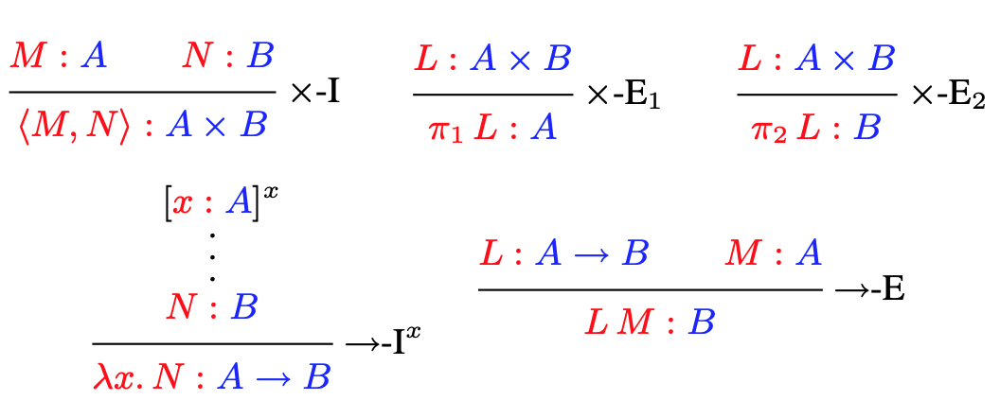
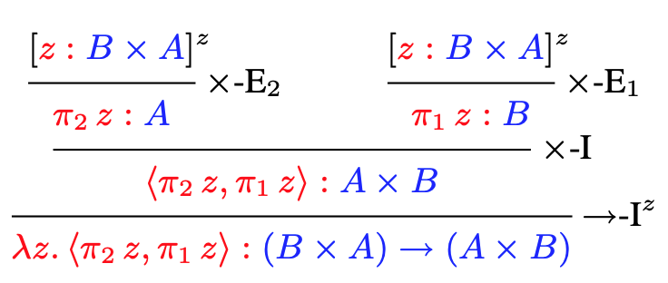
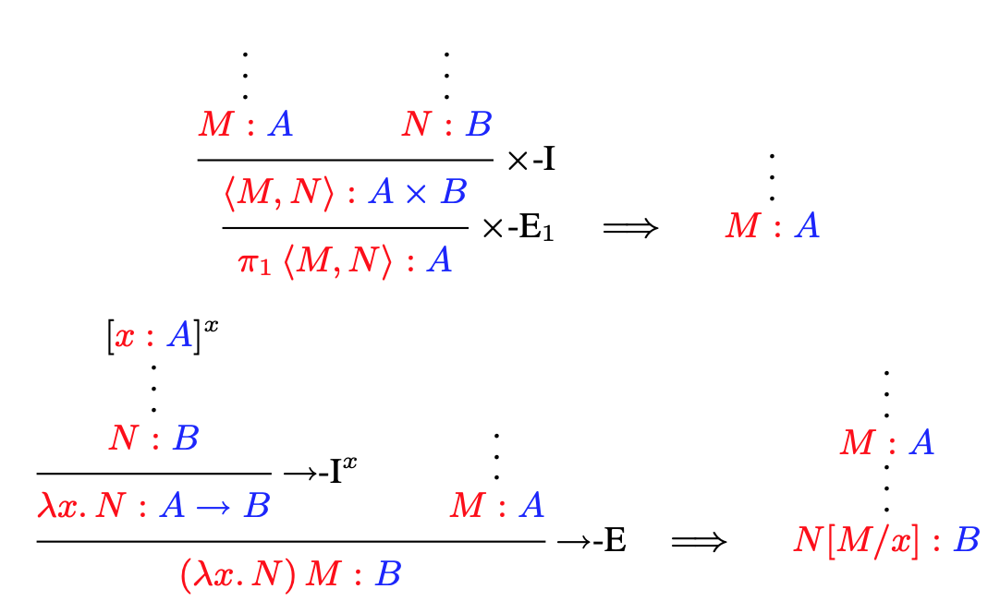
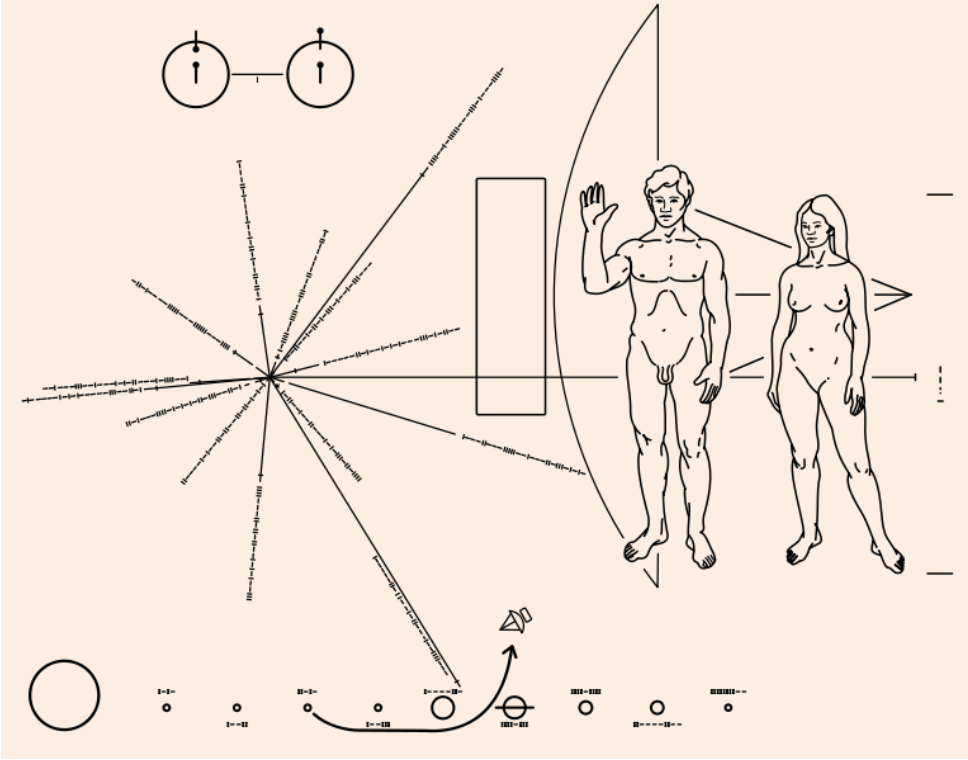

# Утверждения как типы

Филип Вадлер

Эдинбургский университет [wadler@inf.ed.ac.uk](mailto:wadler@inf.ed.ac.uk)

## 1. Введение

Мощные идеи возникают в результате объединения двух областей исследования, которые раньше считались отдельными. Например Декартовы координаты, которые связывают геометрию с алгеброй, квантовая теория Планка, которая связывает частицы с волнами, и теорию информации Шеннона, которая связывает термодинамику с теорией передачи информации. Принцип «Утверждения как типы» позволяет связать логику с теорией вычислений. На первый взгляд он кажется простым совпадением – почти каламбуром – но он оказывается удивительно надежным, вдохновляющим на разработку автоматизированных пруверов и языков программирования и продолжает оказывать влияние на передовые компьютерные технологии.

Утверждения как типы — это понятие, имеющее множество названий и разное происхождение. Оно тесно связано с интерпретацией БХК — взглядом на логику, разработанным интуиционистами Брауэром, Хейтингом и Колмогоровым в 1930-х годах. Его часто называют изоморфизмом Карри-Говарда, имея в виду соответствие, обнаруженное Карри в 1934 году и уточненное Ховардом в 1969 году (впервые опубликовано в 1980 году в юбилейном издании, посвященном Карри). Другие обращают внимание на значительный вклад «Автомата» де Брейна и теории типов Мартина-Лофа 1970-х годов. В литературе встречается множество вариантов названий, в том числе «Формулы как типы», «Соответствие Карри-Говарда-де Брюйна», «Изречения Брауэра» и другие.

Предложения как типы — это понятие глубокое. Оно описывает соответствие между данной логикой и данным языком программирования. На первый взгляд оно говорит о том, что каждому утверждению в логике соответствует соответствующий тип в языке программирования — и наоборот. Таким образом, мы имеем

*утверждения как типы.*

Оно идет глубже: для каждого доказательства данного утверждения существует программа соответствующего типа — и наоборот. Таким образом, мы также имеем

*доказательства как программы.*

И дажет еще глубже: каждому способу упростить доказательство соответствует соответствующий способ выполнения программы — и наоборот. Таким образом, мы далее имеем

*упрощение доказательств как выполнение (исполнение) программ.*

Следовательно, мы имеем не просто неглубокую биекцию между предложениями и типами, а истинный изоморфизм, сохраняющий глубокую структуру доказательств и программ, упрощения и исполнения.

Утверждения как типы — это широкое понятие. Оно применимо к ряду логик, включая пропозициональную, предикатную, второго порядка, интуиционистскую, классическую, модальную и линейную. Оно лежит в основе основ функционального программирования, объясняя функции, записи, варианты, параметрический полиморфизм, абстракцию данных, продолжения, линейные типы и сеансовые типы. Оно вдохновило на создание автоматизированных пруверов и языков программирования, включая `Agda` , `Automath` , `Coq` , `Epigram` , `F#` , `F*` , `Haskell` , `LF` , `ML` , `NuPRL` , `Scala` , `Singularity` и `Trellys`.

Утверждения как типы — понятие загадочное. Почему интуиционистская естественная дедукция, разработанная Генценом в 1930-х годах, и нетипизированное лямбда-исчисление, разработанное Чёрчем примерно в то же время для других целей, тридцать лет спустя оказались по существу идентичными? И почему одно и то же соответствие возникает снова и снова? Логик Хиндли и ученый-компьютерщик Милнер независимо друг от друга разработали однотипную систему, получившую теперь название Хиндли-Милнера. Логик Жирар и ученый-компьютерщик Рейнольдс независимо друг от друга разработали одно и то же исчисление, получившее теперь название Жирара-Рейнольдса (система F или лямбда-исчисление второго порядка). Карри-Ховард — двойное имя, но есть и другие двойные имена. Программисты и разработчики языков считают, что они произволны, но «Утверждения как типы» уверяют нас, что некоторые аспекты программирования абсолютны.

PDF документ дополнительно содержит ссылки и историческую заметку, предоставленную Уильямом Ховардом.

Эта статья представляет собой краткое введение в тему «Утверждения как типы». Для тех, кто хочет узнать больше, доступны учебники [23, 59, 56].

## 2. Чёрч и теория вычислений

Истоки логики лежат от Аристотеля и стоиков классической Греции, Оккама и схоластиков в средние века к Лейбница с его   *математике мысли* (calculus ratiocinator) на заре просвещения. Наш интерес к этому предмету связан с формальной логикой, которая возникла благодаря вкладу Буля, Де Моргана, Фреге, Пирса, Пеано и других в XIX веке.

На заре 20-го века *«Principia Mathematica* » Уайтхеда и Рассела [66] продемонстрировали, что формальная логика может выражать большую часть математики. Вдохновленные этим видением, Гильберт и его коллеги из Геттингена стали ведущими сторонниками формальной логики, стремясь поставить ее на прочный фундамент.

Одной из целей программы Гильберта было решение *Entscheidungsproblem* (проблемы принятия решений), то есть разработка «эффективно вычислимой» процедуры для определения истинности или ложности любого утверждения. Проблема предполагает полноту: для любого утверждения либо оно, либо его отрицание обладает доказательством. В своем обращении к Математическому конгрессу 1930 года в Кенигсберге Гильберт подтвердил свою веру в этот принцип, заключив слова «Wir mussen wis-sen, wir werden wissen» («Мы должны знать, мы будем знать») — слова, позже выгравированные на его надгробии. Возможно, надгробие является подходящим местом для этих слов, учитывая, что всякое основание для оптимизма Гильберта было подорвано накануне, когда на той же конференции Гёдель [24] объявил о своем доказательстве неполноты арифметики.

Хотя целью было удовлетворить программу Гильберта, точного определения понятия «эффективно вычислимого» не требовалось. Было бы ясно, эффективна ли данная процедура или нет, как, например, в характеристике непристойности судьей Стюартом: «Я узнаю это, когда увижу это». Но чтобы показать неразрешимость *проблемы Entscheidungs* , требовалось формальное определение понятия «эффективно вычислимое».

Отсылки к понятию алгоритма можно встретить в работах Евклида и, одноимённо, аль-Хорезми, однако формализовать это понятие удалось лишь в XX веке, а затем одновременно получило три независимых определения логиков. Как автобусы: вы ждете две тысячи лет определения понятия «эффективно вычислимое», а затем приходит сразу три. Это были *лямбда-исчисление* , опубликованное в 1936 году Алонзо Чёрчем [9], *рекурсивные функции* , предложенные Гёделем на лекциях в Принстоне в 1934 году и опубликованные в 1936 году Стивеном Клин [35], и *машины Тьюринга* , опубликованные в 1937 году Аланом Тьюрингом [60].

Лямбда-исчисление было введено Чёрчем в Принстоне и далее развито его учениками Россером и Клини. В это время Принстон соперничал с Геттингеном как центр изучения логики. Институт перспективных исследований располагался рядом с математическим факультетом в Файн-холле. В 1933 году в институт присоединились Эйнштейн и фон Нейман, и с визитом приехал Гёдель.

Логики уже давно интересуются идеей функции. Лямбда-исчисление обеспечивает краткое обозначение функций, включая «первоклассные» функции, которые могут выступать в качестве аргументов или результатов других функций. Он удивительно компактен и содержит всего три конструкции: переменные, абстракцию функции и применение функции. Чёрч [7] сначала представил лямбда-исчисление как способ определения обозначений логических формул (почти как макроязык) в новом представлении логики. Все формы связанной переменной можно отнести к лямбда-привязке. (Например, вместо `∃x. A[x]` Чёрч написал `Σ(λx. A[x]` ].) Однако позже Клини и Россер [38] обнаружили, что система Чёрча была противоречивой. К этому времени Чёрч и его студенты осознали, что система представляет независимый интерес. Чёрч предвидел такую ​​возможность в своей первой статье по этому вопросу, где он написал: «Действительно, могут быть и другие применения системы, помимо ее использования в качестве логики».

Чёрч открыл способ кодирования чисел с помощью лямбда-исчисления. Число `n` представлено функцией, которая принимает функцию `f` и значение `x` и применяет эту функцию к значению `n` раз. (Например, три — это `λf.λx.f(f(f(x)))` .) С помощью этого представления легко кодировать лямбда-термины, которые могут складывать или умножать, но было неясно, как кодировать функцию-предшественницу , который находит число на единицу меньше заданного числа. Однажды в кабинете дантиста Клини вдруг увидела, как определить предшественника [34]. Когда Клини принес результат своему руководителю, Чёрч признался, что почти убедил себя в невозможности представления предшественника в лямбда-исчислении. Как только это препятствие было преодолено, Чёрч и его студенты вскоре убедились, что любая «эффективно вычислимая» функция чисел может быть представлена ​​членом лямбда-исчисления.

Чёрч предложил λ-определимость как определение «эффективно вычислимого», то, что мы теперь знаем как тезис Чёрча, и продемонстрировал, что существует проблема, решение которой не является λ-определимым, а именно определение того, имеет ли данный λ-терм нормальную форму. , то, что мы теперь знаем как проблема остановки [9]. Год спустя он продемонстрировал, что не существует λ-определяемого решения проблемы Entscheidungs ​​[8].

В 1933 году Гёдель приехал с визитом в Принстон. Его не убедило утверждение Чёрча о том, что каждая эффективно вычислимая функция является λ-определимой. Чёрч ответил, предложив, что если Гёдель предложит другое определение, то Чёрч «обязуется доказать, что оно включено в λ-определимость». В серии лекций в Принстоне в 1934 году, основываясь на предложении Эрбрана, Гёдель предложил в качестве кандидата на эффективную вычислимость то, что стало известно как «общерекурсивные функции». Клини сделала заметки и опубликовала определение [35]. Чёрч и его ученики вскоре определили, что эти два определения эквивалентны: каждая общерекурсивная функция λ-определима, и наоборот. Доказательство было изложено Чёрчем [8] и подробно опубликовано Клини [36]. Этот результат не успокоил Гёделя, а заставил его усомниться в правильности его собственного определения! Дело зашло в тупик.

Тем временем в Кембридже Алан Тьюринг, ученик Макса Ньюмана, независимо сформулировал свое собственное понятие «эффективно вычислимого» в форме того, что мы теперь называем машиной Тьюринга, и использовал его, чтобы показать неразрешимость *проблемы Entscheidungs* . Еще до публикации статьи Ньюман был встревожен, обнаружив, что Тьюринга подхватил Черч. Однако подход Тьюринга достаточно отличался от подхода Чёрча, чтобы заслужить независимую публикацию. Тьюринг поспешно добавил к своим машинам приложение, описывающее эквивалентность λ-определимости, и его статья [60] появилась в печати через год после статьи Чёрча, когда Тьюрингу было 23 года. Ньюман организовал поездку Тьюринга в Принстон, где он защитил докторскую диссертацию под руководством Тьюринга. Надзор церкви.

Самое существенное отличие Тьюринга от Чёрча заключалось не в логике или математике, а в философии. В то время как Чёрч просто представил определение λ-определимости и открыто заявил, что оно соответствует эффективной вычислимости, Тьюринг предпринял анализ возможностей «компьютера» — в то время этот термин относился к человеку, выполняющему вычисления с помощью бумаги и бумаги. карандаш. Тьюринг утверждал, что число символов должно быть конечным (поскольку, если бы оно было бесконечным, некоторые символы были бы сколь угодно близки друг к другу и неразличимы), что число состояний сознания должно быть конечным (по той же причине) и что число рассматриваемые символы в данный момент должны быть ограничены («Мы не можем с первого взгляда сказать, являются ли 9999999999999999 и 999999999999999 одинаковыми»). Позже Ганди [18] укажет, что аргумент Тьюринга сводится к теореме, утверждающей, что любое вычисление, которое может выполнить человек с бумагой и карандашом, также может быть выполнено машиной Тьюринга. Именно аргумент Тьюринга окончательно убедил Гёделя; поскольку λ-определимость, рекурсивные функции и машины Тьюринга оказались эквивалентными, он теперь признал, что все три определяют «эффективно вычислимые».

Как уже упоминалось, первым использованием лямбда-исчисления Чёрчем было кодирование логических формул, но от этого пришлось отказаться, поскольку это приводило к несогласованности. Неудача возникла по причине, связанной с парадоксом Рассела, а именно: система позволяла предикату действовать сам на себя, и поэтому Чёрч адаптировал решение, аналогичное расселовскому, — классификацию терминов по типам. Просто типизированное лямбда-исчисление Чёрча исключало возможность самостоятельного применения, позволяя лямбда-исчислению поддерживать непротиворечивую логическую формулировку [10].

В то время как самоприменение в логике Рассела приводит к парадоксу, самоприменение в нетипизированном лямбда-исчислении Чёрча приводит к непрерывным вычислениям. И наоборот, простое лямбда-исчисление Чёрча гарантирует, что каждый терм имеет нормальную форму, то есть соответствует остановленному вычислению.

Два применения лямбда-исчисления — для представления вычислений и для представления логики — в некотором смысле являются взаимоисключающими. Если понятие вычисления достаточно мощное, чтобы представить любую эффективно вычислимую процедуру, то это понятие недостаточно мощное, чтобы решить собственную проблему остановки: не существует эффективно вычислимой процедуры, позволяющей определить, завершается ли данная эффективно вычислимая процедура. Однако непротиворечивость логики Чёрча, основанной на просто типизированном лямбда-исчислении, зависит от того, имеет ли каждый терм нормальную форму.

Нетипизированное лямбда-исчисление или типизированное лямбда-исчисление с конструкцией для общей рекурсии (иногда называемой оператором фиксированной точки) позволяет определить любую эффективно вычислимую функцию, но имеет неразрешимую проблему остановки. Типизированные лямбда-исчисления без конструкции для общей рекурсии имеют тривиальную проблему остановки — каждая программа останавливается! — но не может определить некоторые эффективно вычислимые функции. Оба вида исчисления имеют свое применение в зависимости от предполагаемого применения.

Помимо фундаментального вклада в языки программирования, Черч также внес ранний вклад в верификацию аппаратного обеспечения и проверку моделей, как описано Варди [62].

## 3. Генцен и теория доказательства.

Второй целью программы Гильберта было установление непротиворечивости различных логик. Если логика противоречива, то она может вывести любую формулу, сделав ее бесполезной.

В 1935 году, в возрасте 25 лет, Герхард Генцен [20] представил не одну, а две новые формулировки логики: естественную дедукцию и секвенциальное исчисление, которые утвердились как две основные системы формулирования логики и остаются таковыми по сей день. Он показал, как нормализовать доказательства, чтобы они не были «окольными», что привело к новому доказательству непротиворечивости системы Гильберта. И, в довершение всего, чтобы соответствовать использованию символа `∃` для экзистенциальной квантификации, введенной Пеано, Генцен ввел символ V для обозначения универсальной квантификации. Он написал импликацию как `A ⊃ B` (если выполнено `A` , то выполнено `B` ), конъюнкцию как `A & B` (имеет место и `A` , и `B` ), а дизъюнкцию как `A ∨ B` (имеет место хотя бы одно из `A` или `B` ).

Идея Генцена заключалась в том, что правила доказательства должны быть парными, чего не было в более ранних системах, таких как система Гильберта. В естественной дедукции это пары введения и исключения. Правило введения определяет, при каких обстоятельствах можно утверждать формулу с логической связкой (например, чтобы доказать `A ⊃ B` , можно предположить `A` , а затем необходимо доказать `B` ), а соответствующее правило исключения показывает, как использовать эту логическую связку ( например, из доказательства `A ⊃ B` и доказательства `A` можно вывести `B` , свойство, получившее в средние века *modus ponens* ). Как отмечает Генцен: «Введения представляют собой как бы «определения» соответствующих символов, а исключения являются, в конечном счете, не более чем последствиями этих определений».

Следствием этого понимания стало то, что любое доказательство можно было нормализовать до такого, которое не является «окольным», где «в доказательство не входят никакие концепции, кроме тех, которые содержатся в конечном результате». Например, в нормализованном доказательстве формулы `A & B` единственные формулы, которые могут появиться, — это сама формула и ее подформулы `A` и `B` , а также сами подформулы `A` и `B` Никакая другая формула, такая как `(B & A) ⊃ (A & B)` или `A ∨ B` , не может появиться; это называется свойством подформулы. Немедленным следствием стала последовательность. Доказывать ложность — противоречие, написанное `⋏` . Единственный способ прийти к противоречию — это доказать, скажем, что `A ⊃ ⋏` и `A` для некоторой формулы `A` . Но учитывая такое доказательство, его можно было бы нормализовать до доказательства, содержащего только подформулы его заключения, `⋏` . Но у `⋏` нет подформул! Это похоже на старую поговорку: «Какую часть слова «нет» ты не понимаешь?» Логики заинтересовались нормализацией доказательств из-за ее роли в установлении непротиворечивости.

Генцен предпочитал систему естественной дедукции, поскольку она, по его мнению, была более естественной. Он представил Sequent Calculus главным образом как технический инструмент для доказательства свойства подформулы, хотя он имеет и независимый интерес.

Sequent Calculus имеет два ключевых свойства. Во-первых, каждое доказательство естественной дедукции можно преобразовать в доказательство секвентного исчисления и наоборот, поэтому обе системы эквивалентны. Во-вторых, в отличие от естественной дедукции, каждое правило, за исключением одного, обладает тем свойством, что его гипотезы включают только подформулы тех, которые появляются в его заключении. Единственное исключение — правило Cut — всегда можно удалить с помощью процесса, называемого «Устранение выреза». Следовательно, каждое доказательство имело эквивалентную нормальную форму, удовлетворяющую свойству подформулы. Основной интерес Генцена к секвентному исчислению заключался в доказательстве свойства подформулы, хотя секвентивное исчисление имеет особенности, представляющие независимый интерес, такие как обеспечение более симметричного представления классической логики, и сегодня исследователи часто используют формулировки, более близкие к секвентному исчислению, чем к естественной дедукции.

По иронии судьбы, Генцену пришлось ввести секвенционное исчисление, чтобы доказать свойство подформулы естественного вывода. Ему нужно было обходное доказательство, чтобы показать отсутствие обходных доказательств! Позже, в 1965 году, Правиц показал, как напрямую доказать свойство подформулы, предложив способ упростить доказательства методом естественной дедукции; и это заложило основу для работы Говарда, описанной в следующем разделе.

## 4. Предложения как типы

В 1934 году Карри заметил любопытный факт, связывающий теорию функций с теорией импликации [13]. Любой тип функции `(A → B)` можно прочитать как предложение `(A ⊃ B)` , и при таком прочтении тип любой данной функции всегда будет соответствовать доказуемому предложению. И наоборот, для каждого доказуемого предложения существовала функция соответствующего типа. Впоследствии Карри и Фейс [14] расширили соответствие не только от типов и предложений, но и включили термины и доказательства, а также намекнули на связь между оценкой терминов и упрощением доказательств.

В 1969 году Ховард распространил ксерокопированную рукопись [32]. Он не публиковался до 1980 года, когда появился в Festschrift, посвященном Карри. Вдохновленный наблюдением Карри, Говард указал, что существует сходное соответствие между естественной дедукцией, с одной стороны, и просто типизированным лямбда-исчислением, с другой, и четко обозначил третий, самый глубокий уровень соответствия, как описано в введение, что упрощение доказательств соответствует оцениванию программ. Ховард показал, что соответствие распространяется на другие логические связки, конъюнкция и дизъюнкция, расширив свое лямбда-исчисление конструкциями, представляющими пары и непересекающиеся суммы. Точно так же, как правила доказательства входят в пары введения и исключения, так же и правила типизации: правила введения соответствуют способам определения или построения значения данного типа, а правила исключения соответствуют способам использования или деконструкции значений данного типа.

Мы можем описать наблюдение Говарда следующим образом:

- Соединение `A & B` соответствует декартову произведению `A x B` , то есть записи с двумя полями, также известной как пара. Доказательство предложения `A & B` состоит из доказательства `A` и доказательства `B` Аналогично, значение типа `A x B` состоит из значения типа `A` и значения типа `B`
- Дизъюнкция `A ∨ B` соответствует дизъюнктной сумме `A + B` , то есть варианту с двумя альтернативами. Доказательство предложения `A ∨ B` состоит либо из доказательства `A` , либо из доказательства `B` , включая указание того, какое из двух утверждений было доказано. Аналогично, значение типа `A + B` состоит либо из значения типа `A` , либо из значения типа `B` , включая указание на то, является ли это левым или правым слагаемым.
- Импликация `A ⊃ B` соответствует функциональному пространству `A → B` Доказательство предложения `A ⊃ B` состоит из процедуры, которая при доказательстве `A` приводит к доказательству `B` . Аналогично, значение типа `A → B` состоит из функции, которая при применении к значению типа `A` возвращает значение типа `B`

Такое прочтение доказательств восходит к интуиционистам и часто называется интерпретацией БГК, названной в честь Брауэра, Гейтинга и Колмогорова. Брауэр основал интуиционизм [28], а Гейтинг [29] и Колмогоров [39] формализовали интуиционистскую логику и развили описанную выше интерпретацию в 1920-х и 1930-х годах. Реализуемость, введенная Клини [37] в 1940-х годах, основана на аналогичной интерпретации.

Учитывая интуиционистское прочтение доказательств, вряд ли кажется удивительным, что интуиционистская естественная дедукция и лямбда-исчисление так тесно совпадают. Но только после Говарда переписка была изложена четко, так, чтобы ее могли использовать работающие логики и ученые-компьютерщики.

Лист Говарда делится на две половины. Первая половина объясняет соответствие между двумя хорошо понятными понятиями: пропозициональными связками `&` , `∨` , `⊃` с одной стороны и вычислительными типами `×` , `+` , `→` с другой стороны. Вторая половина расширяет эту аналогию и для хорошо понятных понятий из логики предлагает новые понятия для соответствующих им типов. В частности, Ховард предполагает, что кванторы предикатов `∀` и `∃` соответствуют новым типам, которые мы теперь называем *зависимыми типами* .

С введением зависимых типов каждое доказательство в логике предикатов может быть представлено термином подходящего типизированного лямбда-исчисления. Математики и ученые-компьютерщики предложили многочисленные системы, основанные на этой концепции, в том числе «Автомат де Брейна» [17], теорию типов Мартина-Лофа [43], PRL и nuPRL Бейтса и Констебля [3], а также «Исчисление конструкций» Коканда и Юэ [11]. который превратился в помощника по проверке доказательств Coq.

Приложения включают CompCert, сертифицированный компилятор языка программирования C, проверенный в Coq [41]; проверенное на компьютере доказательство теоремы о четырех красках, также проверенное в Coq [25]; части распределенной системы Ensemble, проверенные в NuPRL [27, 40]; и двадцать тысяч строк плагинов для браузера, проверенных на F? [57]. Работа де Брейна не была связана с работой Ховарда, но Ховард напрямую вдохновил Мартина Лофа и все другие работы, перечисленные выше. Говард (справедливо!) гордился своей статьей, называя ее одним из двух величайших достижений своей карьеры [55].

## 5. Интуиционистская логика

В *«Гондольерах* » Гилберта и Салливана Касильде рассказывается, что в младенчестве она была замужем за наследником короля Батавии, но из-за путаницы никто не знает, кто из двух человек, Марко или Джузеппе, является наследником. Встревоженная, она воет: «Тогда ты хочешь сказать, что я замужем за одним из двух гондольеров, но невозможно сказать, за каким?» На что ответ: «Без каких-либо сомнений».

Логика существует во многих разновидностях, и есть одно различие между *классической* и *интуиционистской* . Интуиционисты, обеспокоенные бесцеремонными предположениями некоторых логиков о природе бесконечности, настаивают на конструктивистском понимании истины. В частности, они настаивают на том, что доказательство `A ∨ B` должно показать, какое из `A` или `B` имеет место, и, следовательно, они отвергнут утверждение о том, что Касильда замужем за Марко или Джузеппе, пока один из двоих не будет идентифицирован как ее муж. Возможно, Гилберт и Салливан предвосхитили интуиционизм, поскольку в результате их истории наследником оказывается третий человек, Луис, в которого Касильда, что удобно, уже влюблена.

Интуиционисты также отвергают закон исключенного третьего, который утверждает `A ∨ ¬A` для каждого `A` , поскольку закон не дает подсказки относительно того, какое из `A` или `¬A` имеет место. Хейтинг формализовал вариант классической логики Гильберта, отражающий интуиционистское понятие доказуемости. В частности, закон исключенного третьего доказуем в логике Гильберта, но не в логике Гейтинга. Далее, если к логике Гейтинга в качестве аксиомы добавить закон исключенного третьего, то он станет эквивалентным логике Гильберта. Колмогоров показал, что эти две логики тесно связаны: он дал перевод с двойным отрицанием, такой, что формула доказуема в классической логике тогда и только тогда, когда ее перевод доказуем в интуиционистской логике.

Предложения как типы были впервые сформулированы для интуиционистской логики. Это идеальное соответствие, потому что в интуиционистской интерпретации формула `A ∨ B` доказуема точно тогда, когда кто-то демонстрирует либо доказательство `A` , либо доказательство `B` , поэтому тип, соответствующий дизъюнкции, представляет собой дизъюнктную сумму.

## 6. Другая логика, другие вычисления

Принцип предложений как типов был бы замечательным, даже если бы он применялся только к одному варианту логики и одному варианту вычислений. Насколько же более примечательно то, что это применимо к широкому спектру логики и вычислений.

Квантование пропозициональных переменных в логике второго порядка соответствует абстракции типов в лямбда-исчислении второго порядка. По этой причине лямбда-исчисление второго порядка было открыто дважды: один раз логиком Жаном-Ивом Жираром [21] и один раз учёным-компьютерщиком Джоном Рейнольдсом [53]. По той же причине подобная система, поддерживающая вывод принципиального типа, была открыта дважды: один раз логиком Роджером Хиндли [30] и один раз ученым-компьютерщиком Робином Милнером [45]. Опираясь на это соответствие, Джон Митчелл и Гордон Плоткин [46] заметили, что экзистенциальная квантификация в логике второго порядка в точности соответствует абстракции данных — идее, которая сейчас лежит в основе многих исследований семантики языков программирования. Разработка универсальных типов в Java и C# напрямую опирается на Жирара-Рейнольдса, тогда как системы типов функциональных языков, включая ML и Haskell, основаны на Хиндли-Милнере. Философы могут спорить о том, являются ли математические системы «открытыми» или «разработанными», но одна и та же система, возникающая в двух разных контекстах, утверждает, что здесь правильное слово — «открыто».

Двумя основными вариантами логики являются интуиционистская и классическая. В оригинальной статье Ховарда наблюдалось соответствие с интуиционистской логикой. Лишь два десятилетия спустя это соответствие было расширено и теперь применимо и к классической логике, когда Тим Гриффин [26] заметил, что закон Пирса в классической логике предоставляет тип для оператора call/cc оператора Scheme. Чет Мурти [49] далее отметил, что перевод двойного отрицания Колмогорова и Геделя, широко используемый для связи интуиционистской и классической логики, соответствует преобразованию стиля передачи продолжения, широко используемому как семантиками, так и разработчиками лямбда-исчисления. Париго [50], Кюрьен и Гербелен [12] и Уодлер [64] представили различные вычислительные исчисления, мотивированные соответствиями классической логике.

Модальная логика позволяет маркировать предложения как «необходимо истинные» или «возможно истинные». Кларенс Льюис представил модальную логику в 1910 году, а его учебник 1938 года [42] описывает пять вариантов: S1-S5. Некоторые утверждают, что каждый из этих вариантов имеет интерпретацию как форму вычислений через предложения как типы, а первоначальный взнос за это утверждение даёт интерпретация S4 как поэтапного вычисления, предложенная Дэвисом и Пфеннингом [16], а S5 как пространственно-распределенные вычисления, предложенные Мерфи и др. [48].

Эудженио Моджи [47] представил монады как метод объяснения семантики важных особенностей языков программирования, таких как состояние, исключения и ввод-вывод. Монады получили широкое распространение в функциональном языке Haskell, а затем мигрировали в другие языки, включая Clojure, Scala, F# и C#. Бентон, Бирман и де Пайва [4] заметили, что монады соответствуют еще одной модальной логике, отличной от всей S1-S5.

Темпоральная логика допускает различие между модальностями, такими как «сохраняется сейчас», «сохраняется в конечном итоге» и «сохраняется на следующем временном шаге». Темпоральная логика была впервые формализована Артуром Прайором в его тексте 1957 года [52] и стала играть важную роль в спецификации и проверке вычислительных систем, начиная с работы Амира Пнуэли [51]. Интерпретации темпоральной логики с помощью «Предложений как типов» включают приложение к частичному вычислению Дэвиса [15] и приложение к функциональному реактивному программированию Джеффри [33].

В классической, интуиционистской и модальной логике любая гипотеза может использоваться произвольное количество раз — ноль, один или несколько раз. Линейная логика, введенная в 1987 году Жираром [22], требует, чтобы каждая гипотеза использовалась ровно один раз. Линейная логика «сознательна к ресурсам» в том смысле, что факты могут быть израсходованы и заменены другими фактами, что подходит для рассуждений о мире, в котором ситуации меняются. С самого начала предполагалось, что линейная логика применима к проблемам, важным для ученых-компьютерщиков, и ее первая публикация была не в *«Анналах математики»* , а в *«Теоретической информатике»* . Вычислительные аспекты линейной логики обсуждаются Абрамским [1] и Уодлером [63] и многими другими, а приложения к квантовым вычислениям рассматриваются Гэем [19]. Совсем недавно типы сеансов, способ описания протоколов связи, предложенные Хондой [31], были связаны с интуиционистской линейной логикой Кайреса и Пфеннинга [5] и классической линейной логикой Уодлера [65].

Одним из ключей к соответствию между логикой и вычислениями является изучение теории категорий. И просто типизированное лямбда-исчисление, и интуиционистская естественная дедукция соответствуют понятию декартовой замкнутой категории [54]. Возникает множество расширений этой идеи, включая захватывающее направление работ, связывающих категории, вычисления, линейную логику и квантовую физику [2].

Владимир Воеводский, лауреат Филдсовской медали, вызвал большой интерес своей недавней работой по гомотопической теории типов (HoTT) и одновалентным основаниям, которая связывает топологию с предложениями как типами. Особый год, посвященный этой теме и организованный Институтом перспективных исследований в Принстоне, доме Черча, привел к публикации в прошлом году книги HoTT, которую действительно очень ждали, и авторами которой выступили более 50 математиков и компьютерных ученых, начиная с Акселя. в Цайленберг.

Предложения как типы остаются темой активных исследований.

## 7. Естественный вычет

Теперь мы обратимся к более формальному развитию, представив фрагмент естественной дедукции и фрагмент типизированного лямбда-исчисления в стиле, который проясняет связь между ними.

Начнем с деталей естественной дедукции, определенной Генценом [20]. Правила доказательства показаны на рисунке 1. Чтобы упростить обсуждение, мы рассмотрим только две связки естественной дедукции. Мы пишем `A` и `B` как заполнители для произвольных формул. Союз пишется `A & B` , а импликация — `A ⊃ B`

---

Рисунок 1. Герхард Генцен (1935) — Естественная дедукция

Мы представляем доказательства в виде деревьев, где каждый узел дерева является экземпляром правила доказательства. Каждое правило доказательства состоит из нуля или более формул, написанных над чертой, называемых *посылками* , и одной формулы, написанной под чертой, называемой *заключением* . Интерпретация правила заключается в том, что если все посылки выполняются, то следует вывод.

Правила доказательства представлены парами, с правилами введения и исключения каждой связки, помеченными `-I` и `-E` соответственно. Когда мы читаем правила сверху вниз, правила введения и исключения делают то, что говорят на консервной банке: первое *вводит* формулу связки, которая появляется в заключении, но не в посылках; второй *исключает* формулу связки, которая появляется в посылке, но не в заключении. Правило введения описывает, при каких условиях, по нашему мнению, связка имеет место, и как ее *определить* . Правило исключения описывает, к какому выводу мы можем прийти, когда связка верна, — как ее использовать.

Правило введения конъюнкции `&-I` гласит, что если справедлива формула `A` и справедлива формула `B` , то формулы `A & B` также должны выполняться. Для соединения существуют два правила исключения. Первый, `&-E1` , утверждает, что если справедливы формулы `A & B` , то должна выполняться и формула `A` Второй, `&-E2` , завершает `B` , а не `A`

Правило введения импликации `⊃-I` гласит, что если из предположения о справедливости формулы `A` мы можем вывести формулу `B` , то мы можем заключить, что формула `A ⊃ B` верна, и *снять* это предположение. Чтобы указать, что `A` используется в качестве предположения ноль, один или несколько раз в доказательстве `B` , мы пишем `A` в скобках и связываем его с `B` через многоточие. Доказательство является полным только тогда, когда каждое допущение в нем было снято соответствующим использованием `⊃-I` , что обозначается написанием того же имени (здесь `x` ) в качестве верхнего индекса в каждом экземпляре снятого предположения и в правиле снятия. Правило исключения импликации `⊃-E` гласит, что если верна формула `A ⊃ B` и если верна формула `A` , то мы можем заключить, что формула `B` также верна; как упоминалось ранее, это правило также называется *modus ponens* .

Критически настроенные читатели заметят, что мы используем одинаковый язык для описания правил («когда-то») и формул («подразумевается»). Одна и та же идея применяется на двух уровнях: метауровне (правила) и уровне объекта (формулы), а также в двух обозначениях: линия с посылками вверху и заключением внизу для импликации на метауровне, а символ `⊃` с посылкой слева и вывод справа на уровне объекта. Это почти как если бы для того, чтобы понять импликацию, нужно сначала понять импликацию! Этот логический парадокс Зенона был иронично замечен Льюисом Кэрроллом [6], а это явление было глубоко исследовано Мартином Лофом [44]. Нам не следует позволять этому беспокоить нас; каждый обладает хорошим неформальным пониманием импликации, которое может служить основой для ее формального описания.

Доказательство формулы

`(B & A) ⊃ (A & B)` .

показано на рисунке 2. Другими словами, если выполняются `B` и `A` , то выполняются `A` и `B` Это может показаться настолько очевидным, что едва ли заслуживает доказательства! Однако формулы `B ⊃ A` и `A ⊃ B` имеют разные значения, и нам нужен какой-то формальный способ заключить, что формулы `B & A` и `A & B` имеют одинаковый смысл. Именно это показывает наше доказательство, и обнадеживает то, что оно может быть построено на основе постулируемых нами правил.

---

Рисунок 2. Доказательство

Доказательство выглядит следующим образом. Из `B & A` мы заключаем `A` через `&-E2` , а из `B & A` мы также заключаем `B` через `&-E1` . Из `A` и `B` мы заключаем `A & B` посредством `&-I` . То есть из предположения `B & A` (употребленного дважды) делаем вывод `A & B` . Мы отказываемся от предположения и заключаем `(B & A) ⊃ (A & B)` посредством `⊃-I` , связывая снятые предположения с правилом отказа, записывая `z` в качестве верхнего индекса для каждого.

Некоторые доказательства излишне окольны. Правила упрощения доказательств показаны на рисунке 3, а пример такого доказательства показан на рисунке 4. Давайте сначала сосредоточимся на примере.

---

Рисунок 3. Упрощающие доказательства

---

Рисунок 4. Упрощение доказательства

В верхней части рисунка 4 показано более крупное доказательство, построенное на основе доказательства на рисунке 2. Более крупное доказательство предполагает в качестве предпосылок две формулы, `B` и `A` , и завершается формулами `A & B` Однако вместо того, чтобы сделать вывод напрямую, мы получаем результат окольным путем, чтобы проиллюстрировать пример `⊃-E` , *modus ponens* . Доказательство выглядит следующим образом. Слева приведено ранее доказательство, заключающееся в `(B & A) ⊃ (A & B)` . Справа из `B` и `A` заключаем `B & A` через `&-I` . Объединение этих результатов дает `A & B` по `⊃-E` .

Мы можем упростить доказательство, применив правила перезаписи, показанные на рисунке 3. Эти правила определяют, как упростить доказательство, когда за правилом введения сразу следует соответствующее правило исключения. В каждом правиле показаны два доказательства, соединенные стрелкой, что указывает на то, что *редекс* (доказательство слева) может быть переписан или упрощен, чтобы получить *редукцию* (доказательство справа). Переписывание всегда переносит действительное доказательство в другое действительное доказательство.

Для `&` редекс состоит из доказательства `A` и доказательства `B` , которые в совокупности дают `A & B` с помощью `&-I` , что, в свою очередь, дает `A` с помощью `&-E1` . Редукция состоит просто из доказательства `A` , отбрасывая ненужное доказательство `B` Существует аналогичное правило (не показано), позволяющее упростить появление `&-I` за которым следует `&-E2` .

Для `⊃` редекс состоит из доказательства `B` из предположения `A` , которое дает `A ⊃ B` посредством `⊃-I` , и доказательства `A` , которые в совокупности дают `B` посредством `⊃-E` . Редукция состоит из того же доказательства `B` , но теперь каждое появление предположения `A` заменяется данным доказательством `A` Предположение `A` может использоваться ноль, один или много раз при доказательстве `B` в редексе, поэтому доказательство `A` может быть скопировано ноль, один или много раз при доказательстве `B` в редукте. По этой причине редукт может быть больше, чем редекс, но он будет проще в том смысле, что он устранит ненужный обход посредством поддоказательства `A ⊃ B` .

Мы можем думать о допущении `A` в `⊃-I` как о долге, который погашается доказательством A, представленным в `⊃-E` . Доказательство в редексе накапливает долг и выплачивает его позже; в то время как доказательство в сокращении приносит пользу каждый раз, когда используется предположение. Долг с доказательствами отличается от денежного долга тем, что здесь нет процентов, и одно и то же доказательство можно свободно дублировать столько раз, сколько необходимо для погашения предположения, а это то самое свойство, которого деньги, поскольку их трудно подделать, призваны избегать!

На рис. 4 показано использование этих правил для упрощения доказательства. Первое доказательство содержит экземпляр `⊃-I` за которым следует `⊃-E` , и упрощается за счет замены каждого из двух предположений `B & A` слева копией доказательства `B & A` справа. Результатом является второе доказательство, которое в результате замены теперь содержит экземпляр `&-I` , за которым следует `&-E2` , и еще один экземпляр `&-I` , за которым следует `&-E1` . Упрощение каждого из них приводит к третьему доказательству, которое выводит `A & B` непосредственно из предположений `A` и `B` и не может быть упрощено дальше.

Нетрудно видеть, что доказательства в нормальной форме удовлетворяют свойству подформулы: каждая формула такого доказательства должна быть подформулой одного из его невыполненных предположений или его заключения. Доказательство на рисунке 2 и окончательное доказательство на рисунке 4 удовлетворяют этому свойству, тогда как первое доказательство на рисунке 4 — нет, поскольку `(B & A) D (A & B)` не является подформулой `A & B` .

## 8. Лямбда-исчисление

Теперь обратим внимание на просто типизированное лямбда-исчисление Чёрча [10]. Правила типов показаны на рисунке 5. Чтобы упростить обсуждение, мы возьмем и продукты, и функции в качестве примитивных типов; Исходное исчисление Чёрча содержало только типы функций, производными от которых были произведения. Теперь мы пишем `A` и `B` как заполнители для произвольных типов, а `L` , `M` , `N` как заполнители для произвольных терминов. Типы продуктов записываются `A x B` , а типы функций — `A → B` Теперь вместо формул нашими посылками и выводами являются суждения вида

`M:A`

указывая, что термин M имеет тип A.

---

Рисунок 5. Черч Алонсо (1935 г.) — лямбда-исчисление

Подобно доказательствам, мы представляем производные типов в виде деревьев, где каждый узел дерева является экземпляром правила типа. Правило каждого типа состоит из нуля или более суждений, написанных над линией и называемых посылками, и одного суждения, написанного под линией и называемого заключением. Интерпретация правила заключается в том, что если все посылки выполняются, то следует вывод.

Как и правила доказательства, правила типов существуют в парах. Правило введения описывает, как *определить* или *построить* термин данного типа, а правило исключения описывает, как использовать или *деконструировать* термин данного типа.

Правило введения для продуктов `×-I` гласит, что если термин `M` имеет тип `A` , а термин `N` имеет тип `B` , то мы можем сформировать парный термин `⟨M,N⟩` типа продукта `A × B` Для продуктов действуют два правила исключения. Первый, `×-E1` , утверждает, что если терм `L` имеет тип `A × B` , то мы можем сформировать терм `π₁ L` типа `A` , который выбирает первый компонент пары. Второй, `×-E2` аналогичен, за исключением того, что он образует терм `π₂ L` типа `B`

Правило введения для функций `→-I` гласит, что если для переменной `x` типа `A` мы сформировали терм `N` типа `B` , то мы можем сформировать лямбда-терм `λx. N` типа функции `A → B` Переменная `x` оказывается свободной в `N` и связанной в `λx. N` Невыполненные предположения соответствуют свободным переменным, а снятые предположения соответствуют связанным переменным. Чтобы указать, что переменная `x` может появляться в термине `N` ноль, один или несколько раз, мы пишем `x : A` в скобках и привязываем ее к `N : B` с помощью эллипсов. Терм замкнут только тогда, когда каждая переменная в нем связана соответствующим термом λ. Правило исключения для функций `→-E` гласит, что, учитывая терм `L` типа `A → B` и терм `M` типа `A` мы можем сформировать прикладной терм `LM` типа `B` .

Что касается естественной дедукции, мы отметили, что может возникнуть путаница между импликацией на метауровне и уровне объекта. Для лямбда-исчисления различие более четкое, поскольку у нас есть последствия на метауровне (если термины над строкой хорошо типизированы, то и термины ниже), но функции на уровне объекта (функция имеет тип `A → B` , потому что, если ей передается значение типа `A` , то возвращается значение типа `B` ). То, что раньше было освобождением от предположений (возможно, несколько расплывчатая концепция), становится связыванием переменных (концепция, понятная большинству ученых-компьютерщиков).

Читатель уже заметил поразительное сходство между правилами Генцена из предыдущего раздела и правилами Чёрча из этого раздела: если игнорировать термины в правилах Чёрча, то они будут идентичны, если заменить `&` на `×` и `⊃` на `→` . Цвет правил выбран так, чтобы подчеркнуть сходство.

Программа типа

`(B × A) → (A × B)`

показано на рисунке 6. В то время как разница между `B & A` и `A & B` кажется простой формальностью, разницу между `B × A` и `A × B` легче оценить: преобразование последнего в первое требует замены элементов пары , что и является задачей программы, соответствующей нашему предыдущему доказательству.

---

Рисунок 6. Программа

Программа звучит следующим образом. Из переменной `z` типа `B × A` формируем терм `n₂ z` типа `A` по `x -E₂` , а также терм `π2 z` типа `B` по `×-E2` . Из этих двух формируем пару `π1 z` типа `A × B` посредством `×-I` . Наконец, мы связываем свободную переменную `z` , чтобы сформировать лямбда-терм `λz.⟨π2 z, π1 z⟩` типа `(B × A) → (A × B)` посредством `→-I` , соединяя связанные типизации с правилом связывания, записывая `z` в качестве верхнего индекса для каждого. Функция принимает пару и меняет местами ее элементы точно так, как описано ее типом.

Программу можно оценить путем переписывания. Правила оценки программ показаны на рисунке 7, а пример — на рисунке 8. Давайте сначала сосредоточимся на примере.

---

Рисунок 7. Оценка программ

В верхней части рисунка 8 показана более крупная программа, созданная на основе программы, показанной на рис. 6. Более крупная программа имеет две свободные переменные, `y` типа `B` и `x` типа `A` , и создает значение типа `A × B` Однако вместо того, чтобы строить его напрямую, мы достигаем результата окольным путем, чтобы проиллюстрировать пример применения функции `→-E` . Программа звучит следующим образом. Слева приведена ранее приведенная программа, образующая функцию типа `(B × A) → (A × B)` . Справа из `B` и `A` формируем пару `⟨y, x⟩` типа `B × A` посредством `×-I` . Применение функции к паре образует терм типа `A × B` посредством `→-E` .

---

Рисунок 8. Оценка программы

Мы можем оценить эту программу, применив правила перезаписи, показанные на рисунке 7. Эти правила определяют, как перезаписать термин, когда за правилом введения сразу следует соответствующее правило исключения. Каждое правило показывает два вывода, соединенных стрелкой, что указывает на то, что редекс (термин слева) может быть переписан или вычислен, чтобы получить редукцию (термин справа). При перезаписи всегда происходит перенос допустимого производного типа в другое допустимое производное типа, гарантируя, что при перезаписи сохраняются типы — свойство, известное как субъектная редукция или корректность типа.

Для `×` редекс состоит из терма `M` типа `A` и терма `N` типа `B` , которые в совокупности дают терм `hM, N}` типа `A × B` с помощью `×-I` , что, в свою очередь, дает терм `π1 ⟨M,N⟩` введите `A` по `×-Eᵢ` . Редукция состоит просто из термина `M` типа `A` , отбрасывая ненужный термин `N` типа `B` Существует аналогичное правило (не показано), позволяющее переписать вхождение `×-I` за которым следует `×-E2` .

Для `→` редекс состоит из вывода термина `N` типа `B` из переменной `x` типа `A` , что дает лямбда-терм `λx. N` типа `A → B` с помощью `→-I` и вывод термина `M` типа `A` , которые в совокупности дают применение `(λx. N) M` типа `B` с помощью `→-E` . Редукция состоит из термина `N [M/x]` который заменяет каждое свободное вхождение переменной `x` в термине `N` на термин `M` Далее, если в выводе о том, что `N` имеет тип `B` мы заменим каждое предположение о том, что `x` имеет тип `A` , выводом о том, что `M` имеет тип `A` , мы получим вывод, показывающий, что `N [M/x]` имеет тип `B` Поскольку переменная `x` может появляться в термине `N` ноль, один или несколько раз, термин `M` может быть скопирован ноль, один или много раз в сокращении `N [M/x]` . По этой причине редукт может быть больше, чем редекс, но он будет проще в том смысле, что удален подтермин типа `A → B` Таким образом, освобождение от допущений соответствует применению функции к ее аргументу.

На рис. 8 показано использование этих правил для оценки программы. Первая программа содержит экземпляр `→-I` за которым следует `→-E` , и переписывается путем замены каждого из двух вхождений `z` типа `B x A` слева копией термина `⟨y, x⟩` типа `B × A` справа. В результате получается вторая программа, которая в результате замены теперь содержит экземпляр `×-I` за которым следует `×-E2` , и ещё один экземпляр `×-I` за которым следует `×-E1` . Переписывание каждой из них дает третью программу, которая выводит термин `⟨x, y⟩` типа `A × B` и не может быть вычислена дальше.

Следовательно, упрощение доказательств в точности соответствует вычислению программ, демонстрируя в данном случае, что применение функции к паре действительно меняет местами ее элементы.

##9. Заключение

Предложение как тип формирует наше представление об универсальности некоторых языков программирования.

На космическом корабле «Пионер» имеется табличка, предназначенная для связи с инопланетянами, если кто-нибудь когда-нибудь перехватит ее (см. Рисунок 9). Им может быть легче интерпретировать некоторые его части, чем другие. Радиальная диаграмма показывает расстояние четырнадцати пульсаров и центра галактики от Солнца. Инопланетяне, скорее всего, решат, что длина каждой линии пропорциональна расстоянию до каждого тела. На другой диаграмме изображены люди перед силуэтом Пионера. Если «Звездный путь» дает точное представление об инопланетных видах, они могут ответить: «Они похожи на нас, за исключением того, что у них нет лобковых волос». Однако если система восприятия инопланетян сильно отличается от нашей, они могут быть не в состоянии расшифровать эти закорючки.

---

Рисунок 9. Мемориальная доска на космическом корабле «Пионер».

Что произойдет, если мы попытаемся общаться с инопланетянами, передав компьютерную программу? В фильме «День независимости» герои уничтожают вторгшийся корабль-базу пришельцев, заразив его компьютерным вирусом. При внимательном рассмотрении переданной программы видно, что она содержит фигурные скобки — она написана на диалекте `C` ! Маловероятно, что инопланетные виды будут программировать на `C` , и неясно, смогут ли инопланетяне расшифровать программу, написанную на `C` , если им предоставить ее.

А как насчет лямбда-исчисления? Предложения как типы говорят нам, что лямбда-исчисление изоморфно естественной дедукции. Кажется трудным представить инопланетные существа, не знающие основ логики, и можно было бы ожидать, что проблема расшифровки программы, написанной с помощью лямбда-исчисления, будет ближе к проблеме понимания радиальной диаграммы пульсаров, чем к проблеме понимания изображения мужчины и женщины на мемориальной доске «Пионер».

У нас может возникнуть соблазн заключить, что лямбда-исчисление универсально, но сначала давайте поразмыслим о том, подходит ли слово «универсальный». В наши дни широко распространена интерпретация квантовой физики, основанная на множественности миров. Ученые предполагают, что в разных вселенных можно встретить разные фундаментальные константы, такие как сила гравитации или постоянная Планка. Но как бы легко ни было представить вселенную, в которой гравитация различается, трудно представить себе вселенную, в которой фундаментальные правила логики не применимы. Естественная дедукция и, следовательно, лямбда-исчисление должны быть известны инопланетянам не только во всей нашей Вселенной, но и во всех других странах. Таким образом, мы можем заключить, что было бы ошибкой характеризовать лямбда-исчисление как универсальный язык, поскольку называть его универсальным было бы *слишком ограничивающе* .

**Благодарности** . Спасибо Гершому Базерману, Питу Бевину, Гаю Блеллоху, Ринциусу Блоку, Эзре Куперу, Бену Дарвину, Бенджамину Денкла, Питеру Дюбьеру, Йоханнесу Эмериху, Мартину Эр-вигу, Итцу Гейлу, Михаилу Глушенкову, Габору Грайфу, Виноду Гроверу, Сильвену Генри, Филип Холзенспис, Уильям Ховард, Джон Хьюз, Колин Луптон, Дэниэл Марсден, Крэйг Маклафлин, Том Мортел, Саймон Пейтон-Джонс, Бенджамин Пирс, Ли Пайк, Андрес Сикард-Рамлрес, Скотт Роструп, Данн Толивер, Моше Варди, Джереми Йаллоп , Ричард Зак, Лео Зовик и судьи. Эта работа финансировалась в рамках EPSRC EP/K034413/1.

Филип Уодлер (wadler@inf.ed.ac.uk, @PhilipWadler) — профессор теоретической информатики в Лаборатории основ информатики Школы информатики Эдинбургского университета, Шотландия.

## А. Ховард о Карри-Ховарде

Во время написания этой статьи я понял, что мне неясны некоторые аспекты истории. Ниже приведено письмо, которое я написал Уильяму Ховарду, и его ответ (с исправлениями, которые он внес после того, как я попросил его опубликовать). Я считаю, что это полезный исторический документ, и благодарен Говарду за разрешение опубликовать его. Переписка относится к Шеллу-Геллашу [55], а ссылки на рисунки 5 и 6 в дальнейшем относятся к рисункам в этой статье.

Вот мой первоначальный запрос.

---

Тема: Понятие конструкции «формулы как типы».

---

Дорогой профессор Ховард,

На мое исследование большое влияние оказали ваши собственные, особенно статья, цитируемая по моей теме. Сейчас я пишу статью о сфере деятельности, которая выросла из этой статьи, которую запросил для публикации отдел коммуникаций ACM (флагман профессиональной организации ученых-компьютерщиков). Проект документа прилагается.

Мне хотелось бы точно изобразить историю этого предмета. Я прочитал ваше интервью с Шелл-Галлашем, но осталось несколько вопросов, на которые, надеюсь, вы любезно ответите.

Ваш лист разрывается на две половины. Первый описывает соответствие между логикой высказываний и простыми типами, второй вводит соответствие между логикой предикатов и зависимыми типами. Считали ли вы первую половину новым материалом или просто повторением того, что было известно? В какой степени, по вашему мнению, ваша работа опирается на работы Хейтинга и Колмогорова или была предвосхищена ими, а также реализуемостью Клини? В какой степени ваша работа повлияла на последующее творчество де Брейна и Мартина Лофа? Какова была история вашего мимеографа по этому вопросу и почему он не был опубликован до Curry Festschrift в 1980 году?

Большое спасибо за ваше внимание, не говоря уже о том, что вы основали мою область! Ваш, —П

И вот его ответ:

---

Дорогой профессор Вадлер,

---

Как упоминалось в интервью Шелл-Геллашу, моя работа над предложениями как типами (pat) возникла из моей переписки с Крейзелем, который был очень заинтересован в получении математического понятия (т. е. в обычной математике) для идеи Брауэра о конструкции (как объяснил Хейтинг). Я не был знаком с работами Брауэра или Гейтинга, не говоря уже о Колмогорове, но из того, что говорил Крейзель, идея была достаточно ясна: конструкция а ^ в должна была быть конструкцией F, которая, действуя на конструкцию А a, дает конструкцию B of в. Итак, у нас есть конструкции, действующие на конструкции, подобно функционалам, действующим на функционалы. Итак, в качестве приближения

(1) давайте понимать «конструкцию» как «функциональную».

Но что это за функционал? В конструктивной математике функционал не задается набором упорядоченных пар. Скорее,

(2) дать функционал — значит указать не только действие или процесс, который он выполняет, но и указать его тип (домен и контрдомен).

Очевидно, что структура типов будет сложной. Я поставил перед собой задачу найти подходящие обозначения для типовых символов. Поэтому для функционала F, указанного выше, нужен подходящий символ типа. Ну, просто примите это за саму альфу (в этот момент я думал о пропозициональной логике). Внезапно я вспомнил кое-что, о чем Карри говорил на семинаре по логике во время моего пребывания в Пенсильванском университете. Если мы рассмотрим типизированные комбинаторы и посмотрим на структуру символов типа базовых комбинаторов (например, S, K, I), то увидим, что каждый из символов типа соответствует (изоморфен) одной из аксиом чистых комбинаторов. импликативная логика. Хорошо! Это было именно то, что мне нужно!

Как сформулировать следующее понятие?

(3) `F` является конструкцией phi.

Рассмотрим случай, когда `φ` имеет вид `α ⊃ β` Соблазн состоит в том, чтобы определить, что « `F` — конструкция из `α ⊃ β` означает «для всех `A` : если `A` — конструкция из `α` , то `FA` — конструкция из `β` ». Что ж, это замкнутый круг, потому что мы использовали «если… то…» для определения импликации. Это то, что вы называете «логическим парадоксом Зеноса». Я избежал этой цикличности, приняв (3) за следующее:

(4) `F` присваивается тип `ф` в зависимости от способа построения `F` ; т. е. способ построения `F`

Таким образом, `F` является конструкцией `ф` по построению. Ваш рисунок 6 иллюстрирует именно то, что я имел в виду. (В то время у меня не было этой красивой записи, но она передает то, что я имел в виду.)

Подводя итог: мое основное понимание состояло одновременно из мыслей (2) и (4) плюс мысли, что наблюдение Карри предоставило средства для реализации (2), (4). Позвольте мне сказать это по-другому. Мысль (2) не была новой. Мысль (2) посещала меня уже много лет, с тех пор, как я начал изучать примитивно-рекурсивные функционалы конечного типа. Новым была мысль (4) плюс признание того, что идея Карри обеспечила путь к реализации (4). Это основное понимание я получил летом 1966 года. Как только я увидел, как это сделать с помощью комбинаторов, я задался вопросом, как это будет выглядеть с точки зрения лямбда-исчисления, и, к своему удовольствию, увидел, что это соответствует интуиционистской версии. секвенциального исчисления Генцена.

Кстати, наблюдение Карри относительно типов основных комбинаторов изложено в его книге «Фейс» (Curry-Feys), но я не знал об этом, хотя экземпляр у меня был уже несколько лет (с 1959 года, когда меня наняли в Пенсильванский университет). Состояние). Проработав детали Пэта в течение нескольких месяцев, я начал подумывать о том, чтобы написать его, поэтому решил, что мне лучше посмотреть, есть ли он в книге. Ну, найти его достаточно легко, если знать, что ищешь. Глядя на это, я был шокирован: они не только распространили идеи на секвенциальное исчисление Генцена, но и установили связь между устранением сокращений из вывода и нормализацией соответствующего лямбда-члена. Но, присмотревшись, я пришел к выводу, что у них есть связь, но нет связи. Оказывается, и здесь я был не совсем прав. См. мое замечание об их теореме 5 ниже. Не то чтобы это имело большое значение для чего-либо, что я мог бы опубликовать: даже если бы они имели связь между секвенциальным исчислением Генцена и лямбда-исчислением, у меня было далеко идущее обобщение (т. е. на арифметику Гейтинга).

Вышеизложенное более подробно, чем требуется для ответа на ваши вопросы, но мне нужно было написать это, чтобы прояснить свои мысли по этому поводу; так что я могу также включить вышеизложенное, поскольку думаю, что это вас заинтересует. Он отвечает на один из ваших вопросов: «В какой степени, по вашему мнению, ваша работа опирается или была предвосхищена работами Хейтинга и Колмогорова, а также реализуемостью Клини?» А именно, моя работа основана на работах Хейтинга и Брауэра, благодаря объяснению мне этой работы Крейзелем. Ничто из этого не было предвосхищено работами Гейтинга, Колмогорова и Клини: они не думали о функционалах конечного типа. Хотя я был знаком с рекурсивной реализуемостью Клини, в то время я об этом не думал. Правда, оно затрагивает идеи о конструкциях Брауэра, но далеко не отражает понятие конструкции (правда, Клини когда-то делала замечания по этому поводу, не помню где). Из-за связи между конструкциями и рекурсивной реализуемостью Клини могло иметь место некоторое бессознательное влияние; но, в любом случае, не существенное влияние.

«Повлияла ли ваша работа на последующее творчество де Брейна и Мартина Лофа?» Насколько мне известно, моя работа не оказала никакого влияния на творчество де Брейна. Его работа кажется совершенно независимой от моей. Я помню, что однажды он прислал мне пакет материалов Automath. Проект компьютерной программы для проверки существующих доказательств не показался мне очень интересным, и я не ответил. Меня бы заинтересовала программа для поиска доказательств еще не доказанных результатов! Даже помощник по доказательству был бы в порядке. Почему он прислал мне материалы Automath? Я не помню, какой это был год. Где-то в 1970-е гг. Каким бы ни было сопроводительное письмо, оно не было информативным; просто что-то вроде: «Уважаемый профессор Ховард, вас может заинтересовать следующий материал…». С тех пор я просмотрел две или три его статьи и оставил у меня более благоприятное впечатление. Это хорошая, солидная работа. Очевидно, оригинально. Он самостоятельно открыл идею дериваций как терминов и сопутствующую идею формул-как-типов. Он использует лямбда-термины, но, я думаю, только в целях описания. Другими словами, я не думаю, что у него есть связь между нормализацией и устранением сокращений, но я не проводил подробного исследования его работы. В самом деле, использует ли он вообще систему Генцена? Я просто не знаю. На последние два вопроса легко ответит любой, кто знаком с его работами. В любом случае отдайте ему должное там, где это необходимо. Вкусностей хватит на всех!

Мое влияние на Мартина-Лофа? Никаких проблем. Я встретил его на конференции в Буффало в 1968 году и рассказал ему свои идеи. Его мгновенной реакцией было: «Итак, почему я не подумал об этом?» У него была назначенная встреча в МСЖД на 1968-1969 учебный год, так что у нас было много возможностей поговорить, и он начал разрабатывать свой собственный подход к идеям. В январе 1969 года, главным образом для того, чтобы убедиться, что мы оба ясно понимаем, кто и что открыл, я записал свои собственные идеи в виде рукописных заметок. К тому времени ксероксы были широко распространены, поэтому я отправил копию Крайзелю, а он раздал копии разным людям, включая Жирара. По крайней мере, я думаю, что именно так Жирар получил копию, или, может быть, Мартин-Лоф дал ему ее. Мне нравятся работы Мартина-Лофа. Я мог бы сказать об этом больше, но краткий ответ на ваш вопрос таков: работа Мартина-Лофа возникла из моей. Он всегда отдавал мне должное, и мы хорошие друзья.

Продолжая размышление, я должен упомянуть, что в том первом разговоре Мартин-Лоф предположил, что идея дериваций как терминов будет особенно хорошо работать в связи с теорией естественной дедукции Правица. Я подумал: ладно, но ничего страшного. Собственно, с результатами Правица я в то время еще не был знаком (или был знаком, то лишь смутно). Но это было более серьезное дело, чем я думал, потому что шаги Правица по уменьшению вывода прямо соответствуют шагам сокращения для соответствующего лямбда-члена! На самом деле, для большинства целей мне нравится последовательная формулировка естественной дедукции, приведенная на стр. 33 и 88 работы Соренсена и Уржичина (2006). На самом деле, если к этому добавить левое импликацию-введение (ограничимся чистой импликативной логикой), то получится довольно интересная система P#. Все случаи modus ponens могут быть исключены, а не только те, которым предшествует введение левой импликации. Именно этим я и занимаюсь в своей статье JSL 1980 года «Порядковый анализ термов конечного типа». Кроме того, правило отсечения легко вывести в P# (просто учтите, что для типизированных лямбда-терминов: правильно сформированный термин, замененный на правильно сформированный термин, приводит к правильному формированию термина); следовательно, P# является консервативным расширением системы P* из первой части моей небольшой статьи в Curry Festschrift.

Фраза «формулы как типы» была придумана Крейзелем для того, чтобы у нас было название предмета в нашей переписке. Я бы предположил, что фраза «предложения как типы» была придумана Мартином-Лофом; по крайней мере, во время нашей первой беседы на встрече в Буффало в 1968 году он предположил, что можно думать о типе как о предложении, согласно идее, что в интуиционистской математике значение предложения ф задается видами «все» доказательства ф. Я использую здесь кавычки, потому что мы не говорим о теоретико-множественной завершенной бесконечности.

«Вторая [часть] знакомит с соответствием между логикой предикатов и зависимыми типами». Я вообще не думал об этом в таком ключе. Я хотел дать интерпретацию понятия построения некоторой нетривиальной части интуиционистской математики (арифметики Гейтинга). Часть I статьи была лишь предварительными сведениями к этому. Собственно, то, что вы говорите в pdf, соответствует этому. Здесь не нужны перемены.

«Считаете ли вы первую половину новым материалом или просто повторением того, что было известно?» Новый. Но в январе прошлого года у меня была возможность по-настоящему внимательно просмотреть материал в Curry-Feys, стр. 313-314; и теперь я вижу, что между моей теоремой 2 в части I и их теоремой 5, стр. 326, существует гораздо более тесная связь, чем я думал. Проблемы здесь довольно интересные. Если хотите, могу провести обсуждение.

Во введении к моей небольшой статье я упоминаю, что Тейт оказал на меня влияние. Позвольте мне сказать несколько слов об этом. Летом 1963 года у нас были беседы, в которых он объяснил мне, что разработал теорию бесконечных термов по аналогии с теорией бесконечных доказательств Штте, где нормализация (через лямбда-редукции) бесконечных термов соответствует сокращению исключения соответствующих доказательство. Он не знал, что с этим делать. Он считал свою теорию бесконечных членов своего рода каламбуром теории бесконечных доказательств Штте. Но мы оба согласились, что должна существовать глубокая связь между нормализацией лямбда-членов и устранением сокращения Генцена. Мы ломали голову над этим в течение двух-трех наших разговоров, но так и не смогли найти ответа.

Как объяснялось в первом абзаце этого письма, моя работа возникла из-за проблемы, поставленной Крейзелем; Итак, в начале этой работы я, конечно, не думал об этих разговорах с Тейтом. Но, как упоминалось выше, как только я получил общее представление об актуальности комбинаторов Карри, я задумался, как они будут работать с лямбда-термами. В этот момент я вспомнил свои разговоры с Тейтом. Другими словами, когда я убедился в том, что

(5) исключение сокращения при выводе соответствует нормализации термина, разговоры с Тейтом были очень важны для меня. Скорее всего, я бы заметил (5), не разговаривая с Тейтом. Но кто знает? В любом случае ему следует отдать должное за то, что он заметил соответствие между выводами и терминами. Чего у него не было, так это ассоциированного соответствия между предложениями и типами. На самом деле он не использовал для этого достаточно общего понятия типа. Оглядываясь назад, мы видим, что в его системе существует гомоморфизм, а не изоморфизм предложений к типам.

Мне нужно сказать немного больше о Тейте и типах. Поскольку Шютте распространил свою систему доказательств на трансфинитные порядки, Тейт распространил свою систему термов на уровни трансфинитных типов. У меня уже была своя система примитивно-рекурсивных функционалов трансфинитного типа. В нашей самой первой беседе мы сравнивали идеи на эту тему. Эта тема требует серьезного размышления над понятием типа. Конечно, я уже много думал о понятии типа (из-за (2) выше) еще до того, как встретил Тейта, но мои разговоры с ним усилили эту тенденцию. Мысли о типах очень сильно посещали меня, когда я начал рассматривать (1), (2) выше.

Как уже говорилось, записи были написаны от руки и отксерокопированы; никаких мимеографов. «Почему [они] не были опубликованы до Curry Festschrift в 1980 году?» Прежде всего позвольте мне упомянуть, почему они были опубликованы в Curry Festschrift. Селден выпускал Фестиваль к 80-летию Карри. Он попросил меня внести записи. Я сказал: «Конечно. Напишу улучшенную версию. Теперь я могу добиться большего». Он ответил: «Нет, мне нужны оригинальные записи. Это исторический документ». Иными словами, к тому времени были распространены различные экземпляры и в литературе имелось множество упоминаний о них. Поэтому я напечатал их и отправил.

Почему я не опубликовал их раньше? Просто потому, что они не решили исходную проблему. Таков был вердикт Крейзеля и Гёделя (Крейзель показал или описал работу Гёделю). Фактически, еще до того, как сообщить о работе Крайзелю, я знал, что получил лишь приблизительное представление о конструкции и что нужно проделать еще больше работы. Суть критики заключается в следующем. В своей небольшой статье я не привожу аксиом и правил вывода для доказательства утверждений вида

(3) F является конструкцией ф. Помните, нам следует избегать «логического парадокса Зеноса»! Ответ в том, что доказательства будут выглядеть так, как показано на рисунке 6. Другими словами, рисунок 6 — это не просто программа; это также доказательство (или: оно может быть истолковано как доказательство). Но рисунок 6 также можно интерпретировать как объяснение того, как должна быть построена конструкция (синяя), чтобы иметь заданный тип (красный). Другими словами, такие рисунки, как рисунок 6, реализуют идею (4), упомянутую в начале этого электронного письма; т. е. F присваивается тип ф в соответствии со способом построения F.

Надеюсь, это вас пощекочет; меня это, конечно, щекочет. Конечно, правила вывода такие же, как на рисунке 5. Таким образом, эти простые идеи обеспечивают недостающую теорию конструкций; или, по крайней мере, обеспечить значительный шаг в этом направлении.

В январе 2013 года я обменялся несколькими электронными письмами с Тейтом и Констеблем об истории Пэт. Это заставило меня очень внимательно взглянуть на книгу Карри-Фейса. Вот что я обнаружил, что действительно рассмешило меня: требуемая теория, выводы которой имеют форму, показанную на рис. 5, уже находится в Карри-Фейсе. Правда, чтобы увидеть это, сначала нужно стереть все повороты ( ' ); Кажется, Карри ими одержим. В частности, сотрите турникеты из дерева доказательств на стр. 281. В результате получится именно дерево доказательств общего вида, представленного на рисунке 6. (Подсказка: (• • -)X следует читать «X имеет тип (•) • •)”. Другими словами, перепишите (• • ^)X как X : (• • •).) Что означает Fbc, где F выделено жирным шрифтом? Просто перепишите Fbc как b ^ c. Понимаете? Я эксперт. Вероятно, я мог бы заработать деньги, написав руководство по переводу. Таким образом, требуемая теория — это, по сути, просто теория функциональности Карри (точнее, соответствующий вариант теории Карри). Итак, я пропустил лодку? Мог бы я увидеть все это в 1969 году, если бы у меня была решимость внимательно взглянуть на Карри-Фейса? Я не знаю. Это может потребовать ясности ума, представленной обозначениями на рисунке 5. Есть ли у вас какие-либо идеи, когда и где эти обозначения вошли в употребление?

Еще одно замечание по поводу моей причины не публиковаться. Разве я не чувствовал, что совершил важный прорыв, несмотря на критику Крейзеля и Гёделя? С одной стороны, да. С другой стороны, у меня были сомнения. За исключением Мартина-Лофа, Правица, Тэйта и Жирара, мало кто проявил интерес к этим идеям. Но, возможно, Мартина-Лофа, Правица, Тэйта и Жирара должно было быть достаточно. Вы говорите: «Конечно, Говард гордился той связью, которую он установил, называя ее одним из двух величайших достижений своей карьеры [43]». Должны ли мы оставить этот отрывок в силе? Конечно. Интервью состоялось весной 2000 года. К тому времени я уже получил много похвал от сообщества информатиков. Итак, гордость – вещь особенная. Позвольте мне закончить это на позитивной ноте. В 1969 году Правиц был в США и приехал в МСЖД, чтобы выступить с докладом. Когда он вошел в комнату, он направился ко мне, посмотрел мне в глаза и пожал мне руку. Сообщение было: Молодцы! ЭТО заставило меня гордиться.

Есть еще что сказать; но я думаю, это отвечает на ваши вопросы; поэтому я отправлю его, чтобы избежать дальнейших задержек.

Ваш PDF-файл «Предложения как типы» очень удобен для чтения.

Счет

---

В более позднем сообщении содержались дополнительные подробности об отношениях с Карри и Фейсом [14].

---

Карри заметил поразительный факт:

(1) если базовые комбинаторы типизированы, то типы, которые они получают, имеют ту же структуру, что и различные аксиомы чистой импликативной логики П.

Как легкое следствие этого, получается соответствие между теоремами Р и типами всех комбинаторов, построенных из базовых комбинаторов. Чтобы избежать многословий, сформулируем это на языке системы простых типизированных комбинаторов: существует соответствие между теоремами P и типами типизированных комбинаторов. Только что упомянутое соответствие лучше выразить, если заметить, что существует

2) соответствие дифференцирований в P типам типизированных комбинаторов.

В подходе Карри комбинатору не задается тип; скорее, комбинатор получает тип посредством «базовой теории функциональности», Func. Следовательно, он дает эквивалент

(3) соответствие между теоремами P и теоремами Func (плюс аксиомы, предусмотренные (1)).

Это дано у Карри-Фейса, стр. 313-314. Затем развивается ее вариант, который дает соответствие между выводами в стиле Генцена и «базовой теорией функциональности», адаптированной к лямбда-термам (стр. 315-332).

Рассмотрим интуиционистское секвенциальное исчисление Генцена `LJ` ограниченное импликацией. Таким образом, правилами, характеризующими `LJ` являются: modus ponens, левое импликация-введение и сокращение. Теорема об исключении разреза для этой системы гласит:

(4) Из вывода секвенции в `LJ` можно получить вывод той же секвенции в системе `LJ*, where LJ*` — это `LJ` без правила разреза.

В подходе Карри-Фея к терминам и их типам нетрудно предоставить утверждение, эквивалентное (4), поэтому немного удивительно, что они этого не делают — по крайней мере, не в той форме, которую можно было бы ожидать. . Ближе всего они подходят к этому в формулировке теоремы 5, стр. 326. Более того, теорема 5 имеет пятистраничное доказательство, за которым нелегко следовать, тогда как с точки зрения типизированных лямбда-термов (4) довольно очевидно. А именно, если данный вывод в (4) соответствует терму A, то нормальная форма A обеспечивает требуемый вывод без разрезов. Другими словами, результат (4) легко следует из нормировки A.

Итак, здесь у нас есть небольшая загадка. Мне кажется, что доказательство теоремы 5 в основном посвящено доказательству того, что

(5) типизированный лямбда-терм можно нормализовать.

Если я прав на этот счет, то объяснение загадки состоит в том, что (5) не было широко известно в то время, когда был написан Карри-Фейс (дата публикации: 1958 г.).

---

Позже Говард подробно остановился на своем последнем пункте выше.

---

Что касается вопроса о том, было ли (5) широко известно в то время, когда был написан Карри-Фейс, то, к моему удивлению, ответ таков: по-видимому, нет. Я только что вспомнил, что Робин Ганди, которого я хорошо знал, опубликовал в Curry Festschrift статью о доказательстве Тьюринга (5). (На самом деле он объяснил мне доказательство в 1978 году.) Ганди говорит на стр. 454:

«Самое раннее известное мне опубликованное доказательство [(5)] содержится в книге Карри и Фея «Комбинаторная логика». . . »

Ганди сообщает нам, что (5) сформулировано как следствие теоремы 9, стр. 340. Теорема 9 — монстр. Может быть, кто-нибудь мне когда-нибудь объяснит, что там написано. К счастью, соответствующее следствие, которое находится на стр. 341, ясно сказано (5). В моей борьбе с Карри-Фейсом мне так и не удалось достичь p. 341.

Спасибо, Робин. Хорошее шоу!

Доказательство Тьюринга — это то, о котором мог бы подумать практически каждый (выполнять редексы в стратегическом порядке: сначала «самые правые» — «самые внутренние» — лямбда-операторы высшего типа). Напротив, доказательство Карри-Фея в доказательстве теоремы 5 следует стилю метода вычислимости Тейта («Интенсиональные интерпретации...») или его варианту. По крайней мере, это мое впечатление. Кто-то должен это проверить.

## Рекомендации

1. С. Абрамский. Вычислительные интерпретации линейной логики. Теоретическая информатика, 111(1&amp;2):3-57, 1993.
2. Дж. Баэз и М. Стей. Физика, топология, логика и вычисления: розеттский камень. В Б. Коке, редакторе, «Новые структуры в физике», Конспекты лекций по физике, страницы 91–166. Спрингер-Верлаг, 2009.
3. Дж. Л. Бейтс и Р. Л. Констебль. Доказательства как программы. Транзакции по языкам и системам программирования, 7 (1): 113-136, январь 1985 г.
4. П. Н. Бентон, Г. М. Бирман и В. де Пайва. Вычислительные типы с логической точки зрения. Журнал функционального программирования, 8(2):177-193, 1998.
5. Л. Кайрес и Ф. Пфеннинг. Типы сеансов как интуиционистские линейные предложения. В CONCUR, стр. 222–236, 2010 г.
6. Л. Кэрролл. Что Черепаха сказала Ахиллесу. Mind, 4 (14): 278–280, апрель 1895 г.
7. Церковь. Набор постулатов, лежащих в основе логики. Анналы математики, 33 (2): 346–366, 1932.
8. Церковь. Замечание о проблеме entscheidungs. Журнал символической логики, 1:40–41, 1936. Поступило 15 апреля 1936 года. Исправление, там же, 1:101–102 (1936), получено 13 августа 1936 года.
9. Церковь. Неразрешимая проблема элементарной теории чисел. Американский журнал математики, 58 (2): 345-363, апрель 1936 г. Представлено Американскому математическому обществу 19 апреля 1935 г.; аннотация в Бюллетене Американского математического общества, 41 мая 1935 г.
10. Церковь. Формулировка простой теории типов. Журнал символической логики, 5 (2): 56–68, июнь 1940 г.
11. Т. Коканд и Г. П. Юэ. Расчет конструкций. Информация и вычисления, 76(2/3):95-120, 1988.
12. П.-Л. Курьен и Х. Гербелен. Двойственность вычислений. На Международной конференции по функциональному программированию (ICFP), страницы 233–243, 2000 г.
13. ХБ Карри. Функциональность в комбинаторной логике. Труды Национальной академии наук, 20: 584-590, 1934.
14. Х.Б. Карри и Р. Фейс. Комбинаторная логика. Северная Голландия, 1958 год.
15. Р. Дэвис. Темпорально-логический подход к анализу времени связывания. В книге «Логика в информатике» (LICS), страницы 184–195, 1996 г.
16. Р. Дэвис и Ф. Пфеннинг. Модальный анализ поэтапных вычислений. В «Принципах языков программирования» (POPL), страницы 258–270, 1996 г.
17. Н.Г. де Брёйн. Математический язык Automath, его использование и некоторые расширения. На симпозиуме по автоматической демонстрации, том 125 конспектов лекций по информатике, страницы 29–61. Спрингер-Верлаг, 1968 г.
18. Р. Ганди. Слияние идей в 1936 году. В книге Р. Херкена, редактора, «Универсальная машина Тьюринга: обзор полувека», страницы 51–102. Спрингер, 1995.
19. С. Гей. Квантовые языки программирования: обзор и библиография. Математические структуры в информатике, 16(4):581-600, 2006.
20. Г. Генцен. Untersuchungen uber das logische SchlieBen. Mathe-matische Zeitschrift, 39(2-3):176-210, 405-431, 1935. Перепечатано в [58].
21. Ж.-Ю. Жирар. Функциональная интерпретация и устранение купюр в арифметике высшего порядка, 1972. Парижский университет VII, This D'Etat.
22. Ж.-Ю. Жирар. Линейная логика. Теоретическая информатика, 50:1-102, 1987.
23. Ж.-Ю. Жирар, П. Тейлор и Ю. Лафон. Доказательство и типы. Издательство Кембриджского университета, 1989.
24. К. Гёдель. Uber formal unterscheidbare Satze der Principia Mathematica und verwandter Systeme I. Monatshefte Fur Mathematik und Physik, 38:173-198, 1931. Перепечатано в [61].
25. Г. Гонтье. Формальное доказательство — теорема о четырёх красках. Уведомления AMS, 55(11):1382-1393, 2008 г.
26. Т. Гриффин. Понятие управления «формулы как типы». В «Принципах языков программирования» (POPL), стр. 47–58. ACM, январь 1990 г.
27. М. Хайден и Р. ван Ренесс. Оптимизация многоуровневых протоколов связи. В материалах 6-го Международного симпозиума по высокопроизводительным распределенным вычислениям, HPDC, страницы 169–177. Компьютерное общество IEEE, 1997.
28. Д. Э. Хесселинг. Гномы в тумане: рецепция интуиционизма Брауэра в 1920-е годы. Биркхаузер, 2003.
29. А. Хейтинг. Mathematische Grundlagenforschung Intuitionismus Bewiestheorie. Ergebnisse der Mathematik und ihren Grenagebiete. Шпрингер Верлаг, Берлин, 1934 г.
30. Р. Хиндли. Схема основного типа объекта в комбинаторной логике. Труды Американского математического общества, 146:2960, декабрь 1969 г.
31. К. Хонда. Типы диадического взаимодействия. В CONCUR, стр. 509–523, 1993 г.
32. В.А. Ховард. Понятие конструкции «формулы как типы». В книге Х.Б. Карри: Очерки по комбинаторной логике, лямбда-исчислению и формализму, страницы 479–491. Academic Press, 1980. Оригинальная версия была распространена в частном порядке в 1969 году.
33. А. Джеффри. Причинность бесплатно!: параметричность подразумевает причинность для функциональных реактивных программ. В разделе «Языки программирования встречается проверка программ» (PLPV), страницы 57–68, 2013 г.
34. С. Клини. Истоки теории рекурсивных функций. Анналы истории вычислений, 3 (1): 52–67, 1981.
35. СК Клини. Общерекурсивные функции натуральных чисел. Mathematical Annalen, 112 (1), декабрь 1936 г. Аннотация опубликована в Бюллетене AMS, июль 1935 г.
36. СК Клини. А-определимость и рекурсивность. Математический журнал Дьюка, 2:340–353, 1936.
37. СК Клини. Об интерпретации интуиционистской теории чисел. Журнал символической логики, 10:109–124, 1945.
38. С. К. Клини и Дж. Б. Россер. Непоследовательность некоторых формальных логик. Анналы математики, 36: 630–636, 1936.
39. А. Н. Колмогоров. Zur deutung der intuitionistischen logik. Mathematische Zeitschrift, 35:58–65, 1932.
40. К. Крейц. Построение надежных, высокопроизводительных сетей с помощью системы разработки nuprlproof. Журнал функционального программирования, 14(1):21-68, 2004.
41. X. Лерой. Формальная проверка реалистичного компилятора. Коммун. АКМ, 52(7):107–115, 2009.
42. К. Льюис и К. Лэнгфорд. Символическая логика. 1938 г. переиздано Дувром, 1959 г.
43. П. Мартин-Лоф. Интуиционистская теория типов. Библиополис Неаполь, Италия, 1984 г.
44. П. Мартин-Лоф. О значении логических констант и обосновании логических законов (Siena Lectures, 1983). Северный журнал философской логики, 1 (1): 11-60, 1996.
45. Р. Милнер. Теория полиморфизма типов в программировании. Дж. Компьютер. Сист. Sci., 17(3):348-375, 1978.
46. Дж. К. Митчелл и Г. Д. Плоткин. Абстрактные типы имеют экзистенциальный тип. Транзакции по языкам и системам программирования, 10 (3): 470-502, июль 1988 г.
47. Э. Могги. Понятия вычислений и монад. Информация и вычисления, 93(1):55-92, 1991.
48. Т. Мерфи VII, К. Крери, Р. Харпер и Ф. Пфеннинг. Симметричное модальное лямбда-исчисление для распределенных вычислений. В книге «Логика в информатике» (LICS), страницы 286–295, 2004 г.
49. К. Мурти. Семантика вычислений для классических доказательств. В книге «Логика в информатике» (LICS), страницы 96–107, 1991 г.
50. М. Париго. Ар-исчисление: алгоритмическая интерпретация классической естественной дедукции. В книге «Логическое программирование и автоматическое рассуждение», том 624 конспектов лекций по информатике, страницы 190–201. Спрингер-Верлаг, 1992.
51. А. Пнуэли. Временная логика программ. В FOCS, стр. 46–57, 1977 г.
52. А. Прайор. Время и модальность. 1957.
53. Джей Си Рейнольдс. К теории типовой структуры. На симпозиуме по программированию, том 19 конспектов лекций по информатике, страницы 408–423, 1974 г.
54. Д. Скотт. Соответствующие теории А-исчисления. В книге Х.Б. Карри: Очерки по комбинаторной логике, лямбда-исчислению и формализму, страницы 375–402. Академик Пресс, 1980.
55. А.Е. Шелл-Геллаш. Размышления моего наставника: Рассказы о математике и математиках. The Mathematical Intelligencer, 25(1):35-41, 2003.
56. М. Х. Соренсен и П. Уржичин. Лекции по изоморфизму Карри-Говарда. Эльзевир, 2006.
57. Н. Свами, Дж. Чен, К. Фурне, П. Струб, К. Бхаргаван и Дж. Янг. Безопасное распределенное программирование с использованием типов, зависящих от значений. В ММТ Чакраварти, З. Ху и О. Дэнви, редакторах, Международная конференция по функциональному программированию (ICFP), страницы 266–278. АКМ, 2011.
58. М. Е. Сабо, редактор. Сборник статей Герхарда Генцена. Северная Голландия, 1969 год.
59. С. Томпсон. Теория типов и функциональное программирование. Аддисон-Уэсли, 1991.
60. А. М. Тьюринг. О вычислимых числах с применением к проблеме Entscheidungs. Труды Лондонского математического общества, стр. 2-42 (1), 1937 г. Поступило 28 мая 1936 г., прочитано 12 ноября 1936 г.
61. Дж. ван Хейеноорт. От Фреге до Геделя: справочник по математической логике, 1879–1931. Издательство Гарвардского университета, 1967.
62. МОЙ Варди. Из церкви и до PSL. В О. Грумберге и Х. Вейте, редакторах, «25 лет проверки моделей — история, достижения, перспективы», том 5000 конспектов лекций по информатике, страницы 150–171. Спрингер, 2008.
63. П. Вадлер. Вкус линейной логики. В «Математических основах информатики» (MFCS), том 711 LNCS, страницы 185–210. Спрингер-Верлаг, 1993.
64. П. Вадлер. Вызов по значению двойственен вызову по имени. В Международной конференции по функциональному программированию (ICFP), страницы 189–201. АКМ, 2003.
65. П. Вадлер. Предложения как сессии. В Международной конференции по функциональному программированию (ICFP), страницы 273–286. АКМ, 2012.
66. А. Н. Уайтхед и Б. Рассел. Принципы математики. Издательство Кембриджского университета, 1912.
